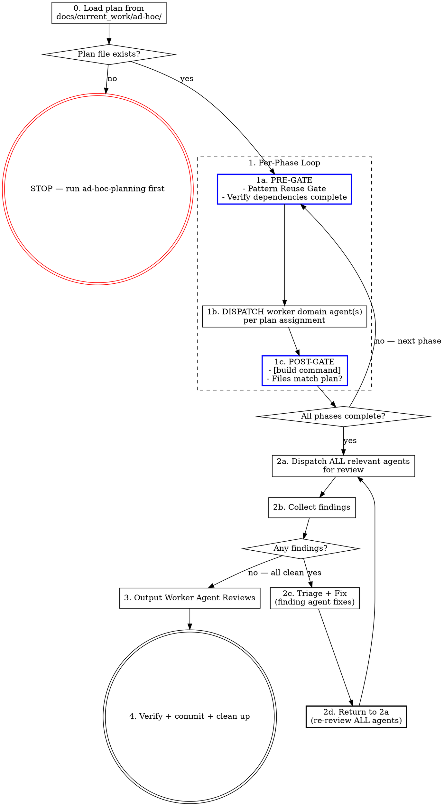

# Ad Hoc Execution

This skill executes a plan produced by `ad-hoc-planning`. Worker domain agents implement the phases, review the result, and fix findings. You are the manager — dispatch agents, track completion, and run the review loop until clean.

**Precondition:** A reviewed ad hoc plan must exist at `docs/current_work/ad-hoc/{slug}_plan.md`. If no plan file exists, stop and use `ad-hoc-planning` first.

## The Process



## Step Details

### Manager Rule

**The manager (you) never edits code files.** This applies unconditionally: before dispatching agents, while waiting for agents, after receiving agent results, during the review loop, and at every other point in this skill. There is no phase of this skill — not Phase 1, not any phase — in which it is correct for you to open a file and make a change. If you notice a problem, the correct action is to dispatch the relevant worker domain agent.

**The size of a change is not a valid reason to self-implement.** "This is small, well-defined, and bounded" is not an exception. A one-line type change still gets dispatched. A targeted edit to a single file still gets dispatched. There are no small-change exceptions.

**Complexity is not a valid reason to self-implement.** "I'll implement this directly to avoid context gaps" or "dispatching agents would lose the patterns I've read" reverses the logic entirely. Complexity increases the need for worker domain agents — it does not reduce it. When you have gathered context from reading files, your role is to pass that context to the worker domain agent in the dispatch prompt, not to implement the work yourself.

**If an agent returns without applying its work** (change not reflected in files, agent reported an error, or the change is missing): re-dispatch that agent with the same instructions. Do NOT apply the change yourself. The rule is re-dispatch, not self-implement.

This rule has no exceptions for scope or completeness. Specifically:

- **Parallel agents produced a file conflict** (one agent's write overwrote another's): re-dispatch the overwritten agent with the current file state and instructions to re-apply its changes. Framing the situation as a "merge task" does not make self-implementation appropriate.
- **An agent's work is mostly complete but has gaps or loose ends**: re-dispatch that agent to close the gaps. "Mostly done" is not done. Finishing the last 10% yourself is the same violation as doing 100% yourself.

### Agent Dispatch Protocol

**[PLUGIN: oberskills]** Before dispatching ANY worker domain agent, invoke oberagent if installed. This applies to phase execution, reviews, and fixes.

### 0. Load the Plan

Read the ad hoc plan file from `docs/current_work/ad-hoc/`. If multiple plan files exist, check conversation context or ask the user which plan to execute.

**Read the plan file only.** Do not pre-read implementation files, existing components, or codebase patterns before dispatch. The plan file is sufficient context for the manager. Worker domain agents read the files relevant to their own phases when they execute. Pre-reading implementation files and accumulating context is not management — it is the first step toward self-implementation.

Extract from the plan:
1. **Phases and dependencies** — what runs in parallel vs. sequences
2. **Agent assignments** — which worker domain agent owns each phase
3. **Relevant agents** — the full list for post-execution review

If no plan file exists, stop:

> No ad hoc plan found at `docs/current_work/ad-hoc/`. Use `ad-hoc-planning` first.

### 1. Execute Phases

Follow the plan's phase structure. For each phase:

**PRE-GATE** — you cannot dispatch the phase agent until this block appears in your response:

```
PRE-GATE Phase [N] — [phase name]
Pattern search: [what you searched for] → [found / not found / following pattern at path/to/file.ts]
Dependencies: [phase N complete | none required]
File-conflict check: [parallel only — list files per phase, confirm no overlap | N/A — sequential]
Agent: [agent-name]
```

- **Pattern Reuse Gate:** Search the codebase for existing implementations of what this phase builds. Use LSP `goToImplementation` for interface methods and `findReferences` for hooks/utilities. Use Grep for text patterns in configuration or documentation. If a pattern exists, follow it — consistency over preference.
- Verify all dependency phases are complete
- **File-Conflict Gate (parallel phases only):** Before dispatching two or more phases simultaneously, list every file each phase will modify. If any file appears in more than one phase, those phases MUST run sequentially — dispatch the first phase, wait for POST-GATE to pass, then dispatch the second. Do not rely on the plan's dependency table alone; verify file overlap yourself.
- Confirm the dispatch prompt describes WHAT/WHY — the agent decides HOW

**DISPATCH:** List the agent and phase description before dispatching. Every listed agent must have a corresponding dispatch. If you find yourself editing files directly instead of dispatching an agent, stop — that violates the Manager Rule.

**EXECUTE:** Dispatch the assigned agent. The dispatch prompt must describe WHAT/WHY — implementation HOW is the agent's domain. For independent phases, dispatch in parallel using multiple Agent tool calls in a single message.

**Cross-domain knowledge injection:** When a phase requires an agent to work in a context outside its primary domain, consult `ops/sdlc/knowledge/agent-context-map.yaml` for the other domain's agent and include those knowledge files in the dispatch prompt. Use judgment — only inject when the agent is genuinely crossing into unfamiliar territory. Do not inject for routine single-domain work.

**POST-GATE:**
- Verify build passes: `[build command]` — see project CLAUDE.md
- **File deviation check (mandatory):**
  1. List every file the plan specifies for this phase (created or modified)
  2. List every file the agent actually created or modified (from the git diff or agent report)
  3. Compare the two lists. Any file in list 2 that is NOT in list 1 is a deviation — regardless of whether the agent describes it as "related", "fixing the same pattern", or "obviously necessary"
  4. If any deviation exists: stop, report the extra files to the user, and wait for explicit approval before starting the next phase. Do not proceed on your own judgment that the extra work was warranted.

- **Phase bleeding check:** If an agent returns work that covers scope belonging to a subsequent phase (within plan-listed files): (1) output a one-line note to the user identifying which phase was anticipated, (2) in the subsequent phase's dispatch prompt, include a summary of what the earlier agent already implemented and instruct the agent to verify completeness and implement only what remains. If the bleeding substantially changes a subsequent phase (e.g., makes it a verify-only pass), flag to the user rather than silently absorbing.

A phase is NOT complete until POST-GATE passes.

### 2. Completion Review Loop

After ALL phases are done, run the review-fix loop. This is mandatory and repeats until every agent reports clean.

#### 2a. Dispatch ALL Review Agents

List every relevant worker domain agent from the plan. Dispatch ALL of them — not a subset. Include `code-reviewer` if it was listed as relevant during planning.

**Review agents report findings only. They do NOT fix anything.** Fixes are dispatched in step 2c after the manager classifies each finding. An agent that fixes inline during review has bypassed the triage gate — that is a process failure, not a shortcut.

#### 2b. Collect Findings

Wait for all agents to return. Output a findings table:

```
Review round N results:
| Agent | Findings | Severity |
|-------|----------|----------|
| agent-1 | specific finding | critical/major/minor |
| agent-2 | no issues | — |
```

**All agents clean → output "Review loop complete — all agents clean. Proceeding to Worker Agent Reviews." then go to step 3.**
**Any findings → go to 2c.**

#### 2c. Triage + Fix

Classify each finding individually — no blanket dismissals. Every finding gets a classification and rationale.

| Classification | When | Action |
|---------------|------|--------|
| **FIX** | Confident in diagnosis and fix | Dispatch the most relevant domain agent to fix it |
| **INVESTIGATE** | Need more info | Dispatch relevant agent to diagnose |
| **DECIDE** | Trade-off or business decision | Invoke the `AskUserQuestion` tool with the finding description and options. Do not type the question as conversational text. Block until the user answers. |
| **PRE-EXISTING** | Finding exists in code this work did not touch | No action — cite the file and explain why it's out of scope |

**Use only these four classifications.** If a finding doesn't fit, use DECIDE.

**PRE-EXISTING** qualifies ONLY if the finding's file is not in the plan's Files list AND was not created or modified by an agent during execution. If the file appears in the Files list, or if an agent touched it during this execution, any finding about that file is in scope — regardless of whether the finding is about the specific function the plan modifies.

Dispatch the most relevant domain agent to fix each finding — this is often the agent who found it, but may be a different agent with deeper expertise in the affected file. Fix dispatches are dispatches — **[PLUGIN: oberskills]** invoke oberagent before dispatching fixes if installed, same as before phase dispatches. Dispatch all FIX agents before re-reviewing.

#### 2d. Re-Review (Mandatory)

After fixes, return to 2a and dispatch ALL agents again — not just the ones who found issues. Fixes can introduce new problems in other domains.

**3-strike rule:** Same finding category 3 times in a row — stop iterating. Output: (1) the finding text, (2) the agent dispatched to fix it, (3) what each attempt returned, (4) your hypothesis for why attempts are failing. Then invoke `AskUserQuestion` to escalate — do not type the escalation as conversational text.

### 3. Worker Agent Reviews

Every ad hoc execution ends with this section, presented in conversation. This step is only reached when 2b shows ALL agents reporting no issues.

```markdown
## Worker Agent Reviews

Key feedback incorporated:

- [agent-name] specific, concrete feedback that was incorporated
- [agent-name] another specific feedback point with actionable detail
```

**Rules:**
- Bracket the agent's exact name: `[frontend-developer]`, `[software-architect]`, etc.
- Each bullet is specific and concrete — not "code looks good" but "input validation on SubmitForm correctly rejects empty values — prevents silent failures on form submission"
- Omit agents that found no issues
- This section is mandatory — the work is not done without it

### 4. Verify, Commit, and Clean Up

1. Run `[build command]` — confirm zero errors (see project CLAUDE.md)
2. Review the git diff for unintended changes
3. Stage all modified files (application code + any new files created by agents)
4. Commit with conventional commit format (see project CLAUDE.md):
   ```
   {type}[({scope})]: {description}

   {optional body — brief summary of what was changed and why}

   Co-Authored-By: Claude Opus 4.6 (1M context) <noreply@anthropic.com>
   ```
5. Move the plan file to `docs/current_work/ad-hoc/completed/` — preserves the "why this approach" context for reconciliation
6. Present the full commit to the user:

```
Commit: {short-sha}

{full commit message — title, body, and footers as written}

Files changed:
- {file path}
- {file path}
```

## What This Skill Does NOT Do

- **No SDLC artifacts.** No result doc, no deliverable tracking, no catalog entry.

## Red Flags

| Thought | Reality |
|---------|---------|
| "There's no plan, I'll wing it" | Stop. Use `ad-hoc-planning` first. |
| "I'll implement this myself" | If a domain agent exists for it, dispatch them. |
| "This phase is small and well-defined, I'll do it directly" | Size is not an exception. Dispatch the agent. |
| "I'll implement directly to avoid context gaps from dispatching" | Complexity increases the need for agents, not decreases it. Pass the context you have to the agent in the dispatch prompt. |
| "I pre-read 8 files so now I have complete context and can implement" | Pre-reading is the first step toward self-implementation. Read the plan file; let agents read the implementation files they need. |
| "Skip re-review, the fixes were small" | Small fixes cause new bugs. 2d says return to 2a. |
| "I'll skip the review loop, everything looks clean" | The review loop catches what confidence misses. Run it. |
| "I dispatched most of the agents" | ALL means ALL. Count the checklist. Count the dispatches. Match. |
| "One more iteration and I'll get it" | Three failed attempts = wrong hypothesis. Escalate to user. |
| "I'll just merge the conflict / fix the loose ends myself" | Parallel conflict or partial completion is still an agent failure. Re-dispatch the affected agent. |
| "This finding is about code I didn't modify in that file" | If the file is in the plan's Files list, the finding is in scope. File presence is the test, not function-level diff. |
| "The review loop finished cleanly" | Output the exit announcement before proceeding. Silent state transitions cause drift. |
| "Build passes, fixes are done — moving on" | Build-pass is step 4, not the review loop exit. After ANY fix round, return to 2a and dispatch ALL agents. Only exit when 2b shows all agents clean. Two audits caught this same skip. |
| "I noted the file deviation but it's reasonable, proceeding" | POST-GATE says "wait for explicit approval." Noting a deviation is not the same as getting approval. Stop and ask — even if the extra file is obviously necessary. |
| "This is a fix dispatch, not a phase dispatch" | Fix dispatches are dispatches. **[PLUGIN: oberskills]** Invoke oberagent if installed. |
| "Phase 2's agent did Phase 3's work — I'll skip Phase 3" | Note the overlap to the user. Dispatch Phase 3 to verify completeness and implement what remains. |

## Integration

- **ad-hoc-planning** — The prerequisite skill that produces the plan file
- **sdlc-execution** — Use instead when executing SDLC deliverable plans
- **test-loop** — If the plan included test files, run after commit to verify tests pass and fix failures automatically
