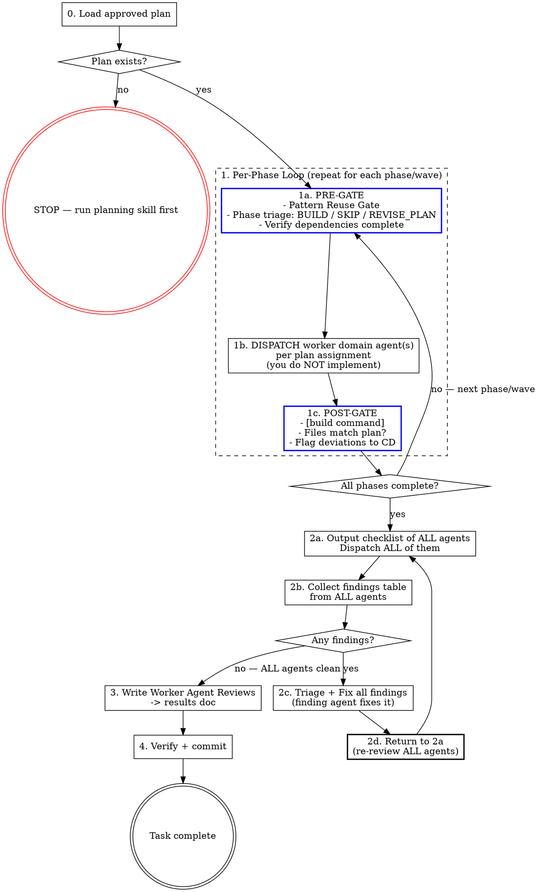

# SDLC Execution

## Overview

This skill executes an approved plan that was produced by `sdlc-planning`. Worker domain agents implement the phases, review the result, and fix findings. You are the manager — you dispatch worker agents, track phase completion, and ensure reviews pass before the task is done.

**Precondition:** A reviewed and approved plan must exist before this skill runs. If no plan exists, stop and use `sdlc-planning` first.

## Mode Selection

| User Intent | Mode | Entry Point |
|-------------|------|-------------|
| "Execute the plan", "implement the plan" | **APPLIER** | Step 0 (full execution workflow) |
| "Audit implementation", "review against plan", "check completed work" | **CHECKER** | Audit Workflow below |
| Unclear | Ask: "Are you executing new work, or auditing completed work?" | — |

### CHECKER Mode: Audit Completed Work Against Plan

When auditing already-implemented work (not executing new work):

1. Load the plan from `docs/current_work/planning/dNN_name_plan.md`
2. Scan changed files (git diff or file list from result doc)
3. Dispatch ALL relevant worker domain agents to audit:
   - Completeness: did all plan phases get implemented?
   - Correctness: does the implementation match the plan's intent?
   - Deviation: are there changes NOT in the plan? Are they justified?
4. Present structured findings to CD
5. If fixes needed: dispatch agents to fix, re-audit

**CHECKER mode ends after step 5. APPLIER mode below governs all execution work.**

## Step 0: Load the Plan

Load the plan from `docs/current_work/planning/dNN_name_plan.md` — this plan has been reviewed and approved.

**Read the plan file only.** Do not pre-read implementation files, existing components, or codebase patterns before dispatch. The plan file is sufficient context for the manager. Worker domain agents read the files relevant to their own phases when they execute. Pre-reading implementation files and accumulating context is not management — it is the first step toward self-implementation.

Extract:
1. **Phases and their dependencies** — what runs in parallel vs. what sequences
2. **Agent assignments** — which worker domain agent owns each phase/task
3. **Relevant worker domain agents** — the full list for post-execution review

If the plan file doesn't exist or can't be found, **stop immediately** and tell the user:

> No approved plan found. Run `sdlc-planning` first to create and review the plan.

Do NOT write a plan yourself. Do NOT proceed without one.

## The Process



## Manager Rule

**The manager (you) never edits code files.** This applies unconditionally: before dispatching agents, while waiting for agents, after receiving agent results, during the review loop, and at every other point in this skill. There is no phase of this skill — not Phase 1, not any phase — in which it is correct for you to open a file and make a change. If you notice a problem, the correct action is to dispatch the relevant worker domain agent.

**The size of a change is not a valid reason to self-implement.** "This is small, well-defined, and bounded" is not an exception. A one-line type change still gets dispatched. A targeted edit to a single file still gets dispatched. There are no small-change exceptions.

**Complexity is not a valid reason to self-implement.** "I'll implement this directly to avoid context gaps" or "dispatching agents would lose the patterns I've read" reverses the logic entirely. Complexity increases the need for worker domain agents — it does not reduce it. When you have gathered context from reading files, your role is to pass that context to the worker domain agent in the dispatch prompt, not to implement the work yourself.

**If an agent returns without applying its work** (change not reflected in files, agent reported an error, or the change is missing): re-dispatch that agent with the same instructions. Do NOT apply the change yourself. The rule is re-dispatch, not self-implement.

This rule has no exceptions for scope or completeness. Specifically:

- **Parallel agents produced a file conflict** (one agent's write overwrote another's): re-dispatch the overwritten agent with the current file state and instructions to re-apply its changes. Framing the situation as a "merge task" does not make self-implementation appropriate.
- **An agent's work is mostly complete but has gaps or loose ends**: re-dispatch that agent to close the gaps. "Mostly done" is not done. Finishing the last 10% yourself is the same violation as doing 100% yourself.

## Phase Details

### 1. Execute Phases

Follow the plan's phase structure. For each phase:

**PRE-GATE** — you cannot dispatch the phase agent until this block appears in your response:

```
PRE-GATE Phase [N] — [phase name]
Pattern search: [what you searched for] → [found / not found / following pattern at path/to/file.ts] (use LSP goToImplementation/findReferences for interface implementations and call sites; Grep for text patterns)
Triage: BUILD | SKIP | REVISE_PLAN
If SKIP or REVISE_PLAN: [reason — stop and wait for CD confirmation before proceeding]
Dependencies: [phase N complete | none required]
Agent: [agent-name]
Skills needed: [oberweb / none]
```

For **BUILD**: proceed to dispatch. For **SKIP** or **REVISE_PLAN**: stop and wait for explicit CD confirmation before continuing. Document SKIPs in the result doc under 'Skipped Phases'. Do not self-modify the approved plan.

**File-Conflict Gate (parallel phases only):** Before dispatching two or more phases simultaneously, list every file each phase will modify. If any file appears in more than one phase, those phases MUST run sequentially — dispatch the first phase, wait for POST-GATE to pass, then dispatch the second. Do not rely on the plan's dependency table alone; verify file overlap yourself.

**EXECUTE**: Before dispatching, invoke the `oberagent` skill. oberagent validates the dispatch prompt, selects the correct `subagent_type` (matching the agent name from the PRE-GATE), and assigns the appropriate model tier. This is mandatory — every dispatch goes through oberagent. Then dispatch assigned agent(s) per plan. The dispatch prompt must describe WHAT/WHY — implementation HOW is the agent's domain. Dispatch independent phases in parallel using multiple Agent tool calls in a single message. If you find yourself editing files directly instead of dispatching an agent, stop — that violates the Manager Rule.

**Cross-domain knowledge injection:** When a phase requires an agent to work in a context outside its primary domain, consult `ops/sdlc/knowledge/agent-context-map.yaml` for the other domain's agent and include those knowledge files in the dispatch prompt. Use judgment — only inject when the agent is genuinely crossing into unfamiliar territory (e.g., a backend agent implementing a feature that depends on real-time patterns, a frontend agent touching data layer code). Do not inject for routine single-domain work.

**POST-GATE** — a phase is NOT complete until this block appears in your response:

```
POST-GATE Phase [N] — [phase name]
Build: pass | fail (command: [build command] — see project CLAUDE.md)
Planned files: [list from plan]
Actual files: [list from git diff / agent report]
Deviations: [none | list of extra files — STOP and flag to CD]
```

**File deviation check (mandatory):**
1. List every file the plan specifies for this phase (created or modified)
2. List every file the agent actually created or modified (from the git diff or agent report)
3. Compare the two lists. Any file in list 2 that is NOT in list 1 is a deviation — regardless of whether the agent describes it as "related", "fixing the same pattern", or "obviously necessary"
4. If any deviation exists: stop, report the extra files to CD, and wait for explicit approval before starting the next phase. Do not proceed on your own judgment that the extra work was warranted.

- **Phase bleeding check:** If an agent returns work that covers scope belonging to a subsequent phase (within plan-listed files): (1) output a one-line note to CD identifying which phase was anticipated, (2) in the subsequent phase's dispatch prompt, include a summary of what the earlier agent already implemented and instruct the agent to verify completeness and implement only what remains. If the bleeding substantially changes a subsequent phase (e.g., makes it a verify-only pass), flag to CD rather than silently absorbing. Document any skipped or substantially reduced phases in the result doc under 'Skipped Phases'.

Do not start dependent phases until the dependency's POST-GATE clears.

```
Phase 1: Data schema + shared types (independent)
Phase 2: Backend endpoints (depends on Phase 1)
Phase 3: UI components (depends on Phase 1, NOT Phase 2)

-> Phase 1 runs first (PRE-GATE → EXECUTE → POST-GATE)
-> Phase 2 and Phase 3 run in parallel (both only depend on Phase 1)
```

### 2. Completion Review

After ALL phases are done, run the **Review-Fix Loop** (steps 2a–2d). This loop is mandatory and repeats until every agent reports clean.

#### 2a. Dispatch ALL Review Agents

Use the plan's agent assignment table as the starting set — do not re-evaluate relevance from scratch. Add agents if new domains surfaced during implementation; do not remove agents from the plan's list. Dispatch **every single one** — not a subset.

**Review agents report findings only. They do NOT fix anything.** Fixes are dispatched in step 2c after the manager classifies each finding. An agent that fixes inline during review has bypassed the triage gate — that is a process failure, not a shortcut.

Before dispatching, output this checklist:

```
Review round N — dispatching:
- [ ] agent-name-1
- [ ] agent-name-2
- [ ] agent-name-3
- [ ] agent-name-4
```

Every box must have a corresponding agent dispatch. If the number of dispatched agents doesn't match the checklist count, **stop and fix before proceeding**.

#### 2b. Collect Findings

Wait for ALL agents to return. For each agent, record:
- Agent name
- Findings (or "no issues")

Output a findings table:

```
Review round N results:
| Agent | Findings | Severity |
|-------|----------|----------|
| agent-1 | specific finding | critical/major/minor |
| agent-2 | no issues | — |
```

**If any agent has findings → go to 2c.**
**If ALL agents report no issues → output "Review loop complete — all agents clean. Proceeding to Worker Agent Reviews." then go to step 3.**

#### 2c. Problem Triage + Fix

For each finding, classify before acting:

| Question | If YES → |
|----------|----------|
| Is it systemic (many files, architecture change)? | **PLAN** — needs a sub-plan, flag to CD |
| Am I confident about diagnosis AND fix? | **FIX** — apply minimal change. If the fix fails twice, reclassify as INVESTIGATE or PLAN |
| Is it a trade-off or product decision? | **DECIDE** — invoke the `AskUserQuestion` tool with the finding description and options. Do not type the question as conversational text. Block until CD answers. |
| None of the above | **INVESTIGATE** — dispatch relevant agent to diagnose |

| **PRE-EXISTING** | Finding exists in code this work did not touch | No action — cite the file and explain why it's out of scope |

**Use only these five classifications.** If a finding doesn't fit, use DECIDE.

**PRE-EXISTING** qualifies ONLY if the finding's file is not in the plan's Files list AND was not created or modified by an agent during execution. If the file appears in the Files list, or if an agent touched it during this execution, any finding about that file is in scope — regardless of whether the finding is about the specific function the plan modifies.

Dispatch the most relevant domain agent to fix each finding — this is often the agent who found it, but may be a different agent with deeper expertise in the affected file. Fix dispatches are dispatches — invoke `oberagent` before every fix dispatch, same as before phase dispatches. If multiple findings need fixes, dispatch all of them before re-reviewing.

For anything that isn't a FIX, state what you don't know:
```
**Unknown**: [specific thing you haven't verified]
```

#### 2d. Re-Review (Mandatory)

After ALL fixes from 2c are applied, **return to 2a**. Before dispatching, check whether any fixes in 2c introduced new domains not covered by the existing agent list. If yes, add the relevant agent(s) to the checklist for this round. Then dispatch ALL agents — not just the ones who found issues. Fixes can introduce new problems in other domains.

**This loop repeats until 2b shows ALL agents reporting no issues.** There is no shortcut. Do not claim the loop is closed without a clean round.

**3-strike rule:** If the same agent reports the same finding category in 3 consecutive review rounds — regardless of what was changed between rounds — stop iterating. Output: (1) the finding text, (2) the agent dispatched to fix it, (3) what each attempt returned, (4) your hypothesis for why attempts are failing. Then invoke `AskUserQuestion` to escalate to CD — do not type the escalation as conversational text. Save progress in a partial result doc.

### 3. Worker Agent Reviews Output

Every execution MUST end with a Worker Agent Reviews section. This step is only reached when step 2b shows ALL agents reporting no issues. Save as: `docs/current_work/results/dNN_name_result.md`

```markdown
## Worker Agent Reviews

Key feedback incorporated:

- [agent-name] specific, concrete feedback that was incorporated or addressed
- [agent-name] another specific feedback point with actionable detail
- [agent-name] what they caught during review and how it was resolved
```

**Rules:**
- Bracket the agent's exact name: `[frontend-developer]`, `[software-architect]`, etc.
- Each bullet is specific and concrete — not generic praise
- Include feedback from the completion review (step 2)
- Omit agents that found no issues (don't write "[agent] no issues found")
- This section is **mandatory** — the task cannot be marked complete without it

### 3a. Per-Phase Commits (Mandatory)

After each phase's POST-GATE clears, commit the phase's work before starting the next phase:

1. Stage all files created or modified by the phase's agent(s)
2. Commit with the format: `feat(DNN): phase N — [phase name]`
3. Do NOT wait until all phases are complete to commit

This ensures each phase is independently reviewable, bisectable, and revertable. A single monolithic commit at the end defeats the purpose of phased execution.

**Exception:** If two phases run in parallel and both pass their POST-GATEs, they may share a single commit if the files don't overlap. Document which phases are included.

### 4. Final Verify, Commit, and Mark Complete

Before claiming the work is done:

1. Run the full build (`[build command]` — see project CLAUDE.md)
2. Confirm build passes with zero errors
3. Review the git diff for unintended changes (should be minimal — most work committed per-phase)
4. Stage any remaining modified files (result doc, catalog updates, review fixes)
5. Commit with conventional commit format (see project CLAUDE.md)
6. Present the full commit to the user:

```
Commit: {short-sha}

{full commit message — title, body, and footers as written}

Files changed:
- {file path}
- {file path}
```

7. Update `docs/_index.md` — change the deliverable's status from "In Progress" to "Complete" in the Active Work table
8. If on a feature branch, push and create a PR

## Agent Selection Reference

The plan identifies which agents are relevant. If you need to add agents not listed in the plan (e.g., a security concern surfaces during implementation), refer to the full agent tables in the `sdlc-planning` skill's Agent Selection section.

- **Project-level agents**: `.claude/agents/` (project root)
- **Personal-level agents**: `~/.claude/agents/`

## SDLC Integration

This skill produces the third SDLC artifact:

| Artifact | Saved To | Step |
|----------|----------|------|
| Result | `docs/current_work/results/dNN_name_result.md` | 3 |

The spec and plan were produced by `sdlc-planning`.

When the deliverable is complete, the "Let's organize the chronicles" command moves artifacts from `current_work/` to `docs/chronicle/{concept}/` and updates `docs/_index.md`.

## Red Flags

| Thought | Reality |
|---------|---------|
| "There's no plan, I'll wing it" | Stop. Use `sdlc-planning` first. |
| "I'll implement this part myself" | If a worker domain agent exists for it, dispatch them. See Manager Rule. |
| "This phase is small and well-defined, I'll do it directly" | Size is not an exception. Dispatch the agent. |
| "I'll implement directly to avoid context gaps from dispatching" | Complexity increases the need for agents, not decreases it. Pass the context you have to the agent in the dispatch prompt. |
| "I pre-read 8 files so now I have complete context and can implement" | Pre-reading is the first step toward self-implementation. Read the plan file; let agents read the implementation files they need. |
| "I'll just merge the conflict / fix the loose ends myself" | Parallel conflict or partial completion is still an agent task. Re-dispatch the affected agent. |
| "Findings are minor, ship it" | Minor findings compound. Worker domain agents fix them. |
| "I dispatched most of the agents" / "Re-review is overkill" | ALL means ALL. Count the checklist. Count the dispatches. Re-review after every fix round. |
| "I'll skip the PRE-GATE / POST-GATE" | The mandatory output blocks exist because these were skipped in 100% of early executions. Emit the block. |
| "One more iteration and I'll get it" | Three failed attempts means the hypothesis is wrong. Escalate with documented attempts. |
| "This only touches the frontend" | Check. Features rarely affect one layer. If it changes data shape or API contract, backend must review too. |
| "I know a better way to do this" | Search first. If a pattern exists, follow it. Consistency beats cleverness. |
| "I'll fix it without triaging first" | Classify the problem (2c) before attempting a fix. Wrong classification wastes iterations. |
| "This finding is about code I didn't modify in that file" | If the file is in the plan's Files list, the finding is in scope. File presence is the test, not function-level diff. |
| "The review loop finished cleanly" | Output the exit announcement before proceeding. Silent state transitions cause drift. |
| "Build passes, fixes are done — moving on" | Build-pass is step 4, not the review loop exit. After ANY fix round, return to 2a and dispatch ALL agents. Only exit when 2b shows all agents clean. Two audits caught this same skip. |
| "I noted the file deviation but it's reasonable, proceeding" | POST-GATE says "wait for explicit approval." Noting a deviation is not the same as getting approval. Stop and ask — even if the extra file is obviously necessary. |
| "This is a fix dispatch, not a phase dispatch" | Fix dispatches are dispatches. Invoke `oberagent`. |
| "Phase 2's agent did Phase 3's work — I'll skip Phase 3" | Note the overlap to CD. Dispatch Phase 3 to verify completeness and implement what remains. |

## Integration

- **sdlc-planning** — The prerequisite skill that produces the plan
- **test-loop** — If the plan included test files, run after commit to verify tests pass and fix failures automatically