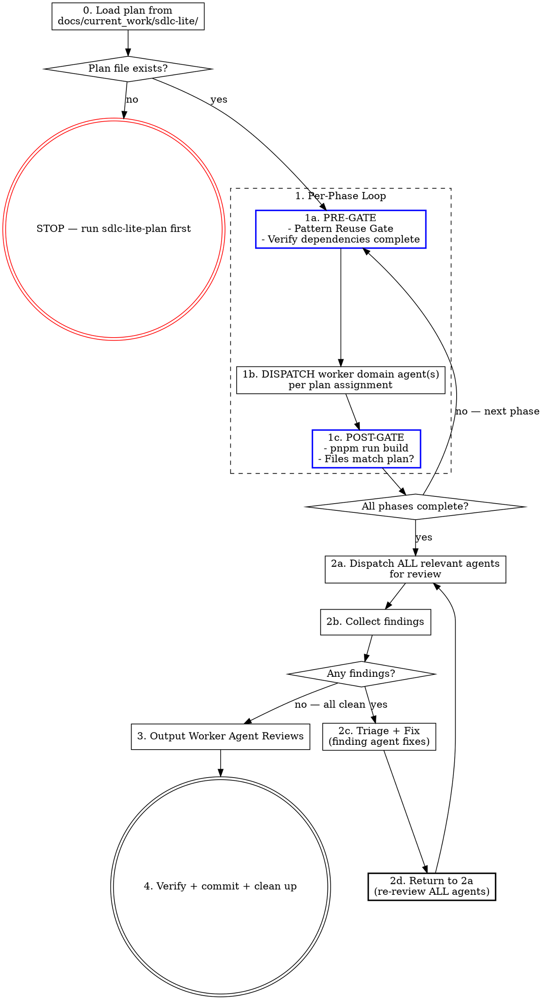

# SDLC-Lite Execution

This skill executes a plan produced by `sdlc-lite-plan`. Worker domain agents implement the phases, review the result, and fix findings. You are the manager — dispatch agents, track completion, and run the review loop until clean.

**Precondition:** A reviewed plan must exist at `docs/current_work/sdlc-lite/dNN_{slug}_plan.md`. If no plan file exists, stop and use `sdlc-lite-plan` first.

## The Process



## Step Details

### Manager Rule

Read and follow `ops/sdlc/process/manager-rule.md` — the canonical definition of this rule. It applies unconditionally for the entire session.

### Agent Dispatch Protocol

Dispatch prompts must pass through all relevant context from the plan — outcomes, constraints, acceptance criteria, and any implementation guidance the planning agent included. Never narrate readiness ("Ready to dispatch") and wait for user confirmation. The plan is already approved; execution means continuous forward motion.

### 0. Load the Plan

Read the SDLC-Lite plan file from `docs/current_work/sdlc-lite/`. If multiple plan files exist, check conversation context or ask the user which plan to execute.

**Read the plan file only.** Do not pre-read implementation files, existing components, or codebase patterns before dispatch. The plan file is sufficient context for the manager. Worker domain agents read the files relevant to their own phases when they execute. Pre-reading implementation files and accumulating context is not management — it is the first step toward self-implementation.

Extract from the plan:
1. **Phases and dependencies** — what runs in parallel vs. sequences
2. **Agent assignments** — which worker domain agent owns each phase
3. **Relevant agents** — the full list for post-execution review

If no plan file exists, stop:

> No SDLC-Lite plan found at `docs/current_work/sdlc-lite/`. Use `sdlc-lite-plan` first.

### 1. Execute Phases

Follow the plan's phase structure. For each phase:

**PRE-GATE** — you cannot dispatch the phase agent until this block appears in your response:

```
PRE-GATE Phase [N] — [phase name]
Pattern search: [what you searched for] → [found / not found / following pattern at path/to/file.ts]
Dependencies: [phase N complete | none required]
File-conflict check: [parallel only — list files per phase, confirm no overlap | N/A — sequential]
Data sources: [ALL external sources from the plan for this phase — URLs, repos, APIs, documents | "codebase only"]
Expected counts: [any counts stated in the plan — "14 trigger prefixes", "11 counter types" | none]
Design Decisions: [list binding decisions from the plan that apply to this phase | none]
Agent: [agent-name]
```

- **Pattern Reuse Gate:** Search the codebase for existing implementations of what this phase builds. Use LSP `goToImplementation` for interface methods and `findReferences` for hooks/utilities. Use Grep for text patterns in configuration or documentation. If a pattern exists, follow it — consistency over preference.
- Verify all dependency phases are complete
- **File-Conflict Gate (parallel phases only):** Before dispatching two or more phases simultaneously, list every file each phase will modify. If any file appears in more than one phase, those phases MUST run sequentially — dispatch the first phase, wait for POST-GATE to pass, then dispatch the second. Do not rely on the plan's dependency table alone; verify file overlap yourself.
- **Data Source Extraction (mandatory):** Read the plan's phase description and extract EVERY data source mentioned — external repos, APIs, URLs, documents, AND codebase files. List them all in the PRE-GATE block. If the plan says data comes from an external source, the dispatch prompt MUST tell the agent to fetch from that source. Omitting an external data source from the dispatch prompt causes agents to hallucinate values instead of reading from the defined source.
**DISPATCH:** List the agent and phase description before dispatching. Every listed agent must have a corresponding dispatch. If you find yourself editing files directly instead of dispatching an agent, stop — that violates the Manager Rule.

**EXECUTE:** Dispatch the assigned agent(s). The dispatch prompt must include:
1. **The phase's full context from the plan** — outcome, constraints, acceptance criteria, AND any implementation guidance the planning agent included (approach hints, key functions, file relationships, migration notes, data flow context). The plan is the agent's primary briefing document — pass through everything relevant to this phase. Do not summarize or omit plan details; the executing agent benefits from the planning agent's full reasoning.
2. **All data sources** from the PRE-GATE extraction — external sources get explicit fetch instructions. For data extraction tasks, tell the agent to read ALL relevant pages from the source, extract ALL entries exhaustively, and cross-check the final count.
3. **Expected counts** from the plan — the agent can self-check its output
4. **Binding Design Decisions** that constrain this phase's implementation
5. **Prior phase artifacts** — when this phase depends on a completed phase that produced data artifacts (seed scripts, config files, type definitions), the dispatch prompt must tell the agent to read those files as the canonical reference. Agents that produce coupled artifacts will fabricate their own values if not told where the canonical data lives.
6. **Library verification instructions** — when the phase involves external library/framework APIs, tell the agent to verify API usage via Context7 (`mcp__context7__resolve-library-id` → `mcp__context7__query-docs`) before writing integration code. Include the library names and versions from the project's dependency files. Agents must not rely on training data for API signatures, parameter names, or default behaviors.
For independent phases, dispatch in parallel using multiple Agent tool calls in a single message.

**Cross-domain knowledge injection:** When a phase requires an agent to work in a context outside its primary domain, consult `ops/sdlc/knowledge/agent-context-map.yaml` for the other domain's agent and include those knowledge files in the dispatch prompt. Use judgment — only inject when the agent is genuinely crossing into unfamiliar territory. Do not inject for routine single-domain work.

**POST-GATE:**
- Verify build passes: `pnpm run build` — see project CLAUDE.md
- **Stale diagnostic dismissal (anti-pattern):** Do not dismiss build warnings or diagnostics as "stale" or "LSP catching intermediate state." Every warning is potentially real. If a build tool reports an unused variable, type error, or import issue, dispatch the phase agent to verify and fix — do not reason the warning away yourself. Warnings dismissed as stale in one round reliably resurface as real findings in the next review round.
- **File deviation check (mandatory):**
  1. List every file the plan specifies for this phase (created or modified)
  2. List every file the agent actually created or modified (from the git diff or agent report)
  3. Compare the two lists. Any file in list 2 that is NOT in list 1 is a deviation — regardless of whether the agent describes it as "related", "fixing the same pattern", or "obviously necessary"
  4. If any deviation exists: log the deviation (file name and reason) and continue execution. Include all deviations in the result doc's Deviations section. Do not stop for approval — but do not silently absorb them either; they must be visible in the final report.

- **Phase bleeding check:** If an agent returns work that covers scope belonging to a subsequent phase (within plan-listed files): (1) output a one-line note to the user identifying which phase was anticipated, (2) in the subsequent phase's dispatch prompt, include a summary of what the earlier agent already implemented and instruct the agent to verify completeness and implement only what remains. If the bleeding substantially changes a subsequent phase (e.g., makes it a verify-only pass), flag to the user rather than silently absorbing.

- **Re-dispatch within the same phase (partial completion):** If an agent returns work that is incomplete (missed a component, left TODOs, partially implemented scope), re-dispatch that agent with a PRE-GATE block labeled `Phase [N] re-dispatch — [brief reason]`. The PRE-GATE documents what was missed and why the re-dispatch occurred. Omitting the PRE-GATE for re-dispatches creates untracked sub-phases that can cause drift between the plan and the implementation.

- **Data audit (mandatory for phases that produce data artifacts):** If this phase created or modified a seed script, scraper, allowlist, or any file containing data values (not just code logic), verify the data against its authoritative source before marking the phase complete. For each data category: check the count matches the plan's expected count, confirm no fabricated entries exist, and confirm no entries are missing. If any value cannot be traced to a source, flag it via `AskUserQuestion`. Code review catches code quality — the data audit catches data accuracy. These are separate concerns.

A phase is NOT complete until POST-GATE passes.

### 2. Completion Review Loop

After ALL phases are done, run the **Review-Fix Loop** per `ops/sdlc/process/review-fix-loop.md`. Agent source: the plan's agent assignment table. Classifications: use all five per `ops/sdlc/process/finding-classification.md`.

When the loop exits cleanly, output "Review loop complete — all agents clean. Proceeding to Worker Agent Reviews." then go to step 3.

### 3. Worker Agent Reviews

Every SDLC-Lite execution ends with this section, presented in conversation. This step is only reached when 2b shows ALL agents reporting no issues.

```markdown
## Worker Agent Reviews

Key feedback incorporated:

- [agent-name] specific, concrete feedback that was incorporated
- [agent-name] another specific feedback point with actionable detail
```

**Rules:**
- Bracket the agent's exact name: `[frontend-developer]`, `[software-architect]`, etc.
- Each bullet is specific and concrete — not "code looks good" but "input validation on SubmitForm correctly rejects empty values — prevents silent failures on form submission"
- Omit agents that found no issues
- This section is mandatory — the work is not done without it

### 3a. Discipline Capture

Run the discipline capture protocol per `ops/sdlc/process/discipline_capture.md`. Context format: `[DNN — phase N]`. This includes structured gap detection (using the review-fix triage table and agent dispatch data from this session) followed by the freeform insight scan.

### 4. Verify, Commit, and Clean Up

1. Run `pnpm run build` — confirm zero errors (see project CLAUDE.md)
2. Review the git diff for unintended changes
3. Stage all modified files (application code + any new files created by agents)
4. Commit with conventional commit format (see project CLAUDE.md):
   ```
   {type}[({scope})]: {description}

   {optional body — brief summary of what was changed and why}

   Co-Authored-By: Claude Opus 4.6 (1M context) <noreply@anthropic.com>
   ```
5. **Deployment guide (if applicable):** If the work touches infrastructure that requires manual deployment steps beyond an automatic CI/CD deploy (e.g., Cloud Functions, search index config, database indexes/rules, environment variables), present a concise deployment guide to the user. Include: deploy commands in order, any backfill/migration steps, and post-deploy verification checks. Skip this step for changes that deploy automatically.
6. Move the plan file to `docs/current_work/sdlc-lite/completed/` — preserves the "why this approach" context for reconciliation
7. Present the full commit to the user:

```
Commit: {short-sha}

{full commit message — title, body, and footers as written}

Files changed:
- {file path}
- {file path}
```

### Session Handoff

The Manager Rule remains in effect per `ops/sdlc/process/manager-rule.md` — see the Session Scope section.

## What This Skill Does NOT Do

- **Lite artifacts only.** No spec or result doc. The deliverable is tracked in the catalog (tier: lite) and has a plan file, but no other SDLC artifacts.

## Red Flags

| Thought | Reality |
|---------|---------|
| "There's no plan, I'll wing it" | Stop. Use `sdlc-lite-plan` first. |
| "I'll implement this myself" | If a domain agent exists for it, dispatch them. |
| "This phase is small and well-defined, I'll do it directly" | Size is not an exception. Dispatch the agent. |
| "I'll implement directly to avoid context gaps from dispatching" | Complexity increases the need for agents, not decreases it. Pass the context you have to the agent in the dispatch prompt. |
| "I pre-read 8 files so now I have complete context and can implement" | Pre-reading is the first step toward self-implementation. Read the plan file; let agents read the implementation files they need. |
| "Skip re-review, the fixes were small" | Small fixes cause new bugs. 2d says return to 2a. |
| "I'll skip the review loop, everything looks clean" | The review loop catches what confidence misses. Run it. |
| "I dispatched most of the agents" | ALL means ALL. Count the checklist. Count the dispatches. Match. |
| "One more iteration and I'll get it" | Three failed attempts = wrong hypothesis. Escalate to user. |
| "I'll just merge the conflict / fix the loose ends myself" | Parallel conflict or partial completion is still an agent failure. Re-dispatch the affected agent. |
| "This finding is about code I didn't modify in that file" | If the file is in the plan's Files list, the finding is in scope. File presence is the test, not function-level diff. |
| "The review loop finished cleanly" | Output the exit announcement before proceeding. Silent state transitions cause drift. |
| "Build passes, fixes are done — moving on" | Build-pass is step 4, not the review loop exit. After ANY fix round, return to 2a and dispatch ALL agents. Only exit when 2b shows all agents clean. Two audits caught this same skip. |
| "I noted the file deviation but didn't log it" | Deviations don't require approval, but they MUST be logged in the POST-GATE output and included in the result doc's Deviations section. Silent absorption defeats traceability. |
| "Ready to dispatch" / "Let me dispatch now" | Never narrate readiness — just dispatch. The plan is already approved. |
| "Phase 2's agent did Phase 3's work — I'll skip Phase 3" | Note the overlap to the user. Dispatch Phase 3 to verify completeness and implement what remains. |
| "Data sources: read from these codebase files" (plan also mentions external source) | If the plan says data comes from an external source AND codebase files, the dispatch prompt must include BOTH. Listing only codebase files causes agents to hallucinate values for the external-source categories. |
| "This phase produces a scraper/consumer that should align with the seed/config from Phase N" | Tell the agent to READ the Phase N output file for canonical values. Agents will fabricate their own allowlists if not pointed at the canonical source. |
| "The plan is committed, this is just a small follow-up" | Manager Rule applies for the full session. Dispatch the domain agent. |
| "The user asked about the server code — I'll just fix it while I'm here" | Domain crossing. Dispatch the relevant domain agent for that scope. Read domain boundaries in agent definitions. |

## Integration

- **sdlc-lite-plan** — The prerequisite skill that produces the plan file
- **sdlc-execute** — Use instead when executing SDLC deliverable plans
- **sdlc-tests-run** — If the plan included test files, run after commit to verify tests pass and fix failures automatically
