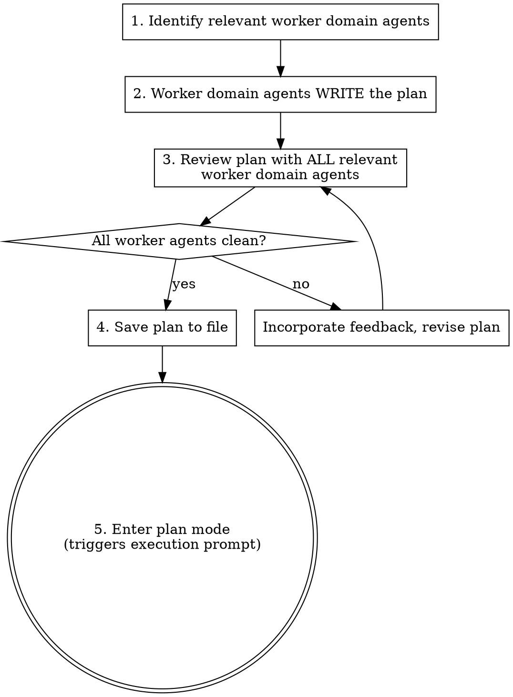

# SDLC-Lite Planning

Domain worker agents write the plan and review it. You are the manager and never do work yourself. This skill produces a plan saved to `docs/current_work/sdlc-lite/`, then enters plan mode so the user gets the standard execution prompt with the option to clear context.

**This skill produces the plan. It does NOT execute it.** Execution happens via `sdlc-lite-execute`.

## When This Applies

The trigger is **complexity**, not file count. Use SDLC-Lite when the work:
- Is complex enough that winging it risks mistakes (multi-step, cross-domain, non-obvious approach)
- Has clear, bounded scope (you know what "done" looks like)
- Benefits from domain agent review before execution
- Was explicitly confirmed as not needing full SDLC tracking by the user

A 2-file change that touches real-time + database warrants a lite plan. A 10-file rename refactor might not. Judge by the complexity of the decisions involved, not the number of files.

If the work introduces entirely new subsystems or architectural patterns — that's likely a full SDLC deliverable. Check with the user.

## Output

This skill produces two things:

1. **Plan file** at `docs/current_work/sdlc-lite/dNN_{slug}_plan.md` — persists across context clears, uses a deliverable ID from the catalog
2. **Plan mode prompt** via `EnterPlanMode` — gives the user the standard execution options (clear context, bypass permissions, etc.)

## The Process



## Agent Selection

Select from project-level worker agents (`.claude/agents/`). If a worker agent's domain touches any aspect of the task, include them. When in doubt, include — a quick review that finds nothing costs less than a shipped bug.

Refer to the full agent table in the `sdlc-plan` skill if you need the complete list. The same worker agents are available here.

## Manager Rule

Read and follow `ops/sdlc/process/manager-rule.md` — the canonical definition of this rule. It applies unconditionally for the entire session.

## Steps

### 0. Register Deliverable ID

1. **Read `docs/_index.md`** to find the next deliverable ID (listed in the header as "Next ID: **DNN**").
2. Claim the ID by incrementing the "Next ID" counter in the catalog.
3. Add the deliverable to the catalog table with status `In Progress (lite)`.

This ID will be used in the plan filename (`dNN_{slug}_plan.md`).

### Agent Dispatch Protocol

Dispatch prompts must pass through all relevant context — outcomes, constraints, and any implementation guidance that would help the agent succeed. Never narrate readiness ("Ready to dispatch") and wait for user confirmation. Dispatch immediately when context is ready.

**Library verification:** When the plan involves external libraries or frameworks, verify API capabilities and constraints via Context7 (`mcp__context7__resolve-library-id` → `mcp__context7__query-docs`) before dispatching the plan-writing agent. Check the project's actual dependency versions (package.json, lock files). Pass verified API details to the writing agent so the plan's scope and acceptance criteria are grounded in real library capabilities, not training-data assumptions.

### 1. Identify Relevant Worker Domain Agents

List which agents are relevant and why. For recurring task types, consult `ops/sdlc/playbooks/` for pre-seeded agent selection and reference implementations. When exploring existing patterns, use LSP (`goToDefinition`, `findReferences`, `goToImplementation`) for type-system and call-graph questions. Use Grep for string literals and non-TypeScript content.

```
Relevant worker domain agents for this task:
- frontend-developer: touches UI components and state management
- ui-ux-designer: new UI element needs design review
- code-reviewer: always included for implementation tasks
```

After listing agents, run the infrastructure coverage check:

```
AGENT-RECONFIRM
Infrastructure touched: [scan each domain's trigger conditions — list every domain where at least one condition is true]
Agents from list above: [list]
Coverage check (infrastructure): [each infra domain → specialist agent if one exists, or "no specialist"]
Agents to add: [list or none]
Updated agent list: [final list]
```

**Infrastructure domain trigger conditions** — check each domain by asking its trigger questions, not by scanning file names:

| Domain | Trigger conditions (if ANY is true, list the domain) | Specialist |
|--------|------------------------------------------------------|------------|
| Real-time/WebSocket | Modifies WebSocket handlers, fan-out, connection lifecycle, or pub/sub patterns? | `realtime-systems-engineer` |
| Database/storage | Adds/modifies schema, queries, indexes, security rules, or storage paths? | `data-architect` |
| Payments | Touches billing, pricing, payment state, or revenue infrastructure? | `payment-engineer` |
| ML/AI | Adds/modifies inference, model pipelines, embeddings, or ML data processing? | `ml-architect` / `ml-engineer` |
| Streaming/broadcast | Modifies streaming state, broadcast components, or media integration? | `realtime-systems-engineer` |
| Auth/security | Introduces unauthenticated endpoints, removes auth guards, exposes new public attack surface, changes token handling, or modifies access control? | `security-engineer` |
| Build/CI | Changes build config, monorepo deps, CI pipeline, or package boundaries? | `build-engineer` |
| Data pipelines | Adds/modifies scrapers, sync functions, ETL, or background processing? | `data-engineer` |
| Search | Changes indexes, filter config, or search infrastructure? | (project-specific — check your agent table) |
| Accessibility | Adds new interactive controls, modifies existing UI components, introduces icon-only buttons, changes color/contrast, or adds components with image backgrounds? | `accessibility-auditor` |

*Customize for your project's infrastructure domains.*

**CHRONICLE-CONTEXT** — after agent selection, scan `docs/chronicle/` for related concepts:

1. List concept directories in `docs/chronicle/`
2. For each concept that could be related, read its `_index.md`
3. If the `_index.md` references deliverables with relevant decisions or patterns, read those result docs
4. Include the relevant context when dispatching agents for plan writing

```
CHRONICLE-CONTEXT
Related concepts found: [list concept names or "none"]
Key context loaded:
- [concept]: [1-line summary of relevant decision/pattern]
Context included in agent dispatch: yes | no (none relevant)
```

This prevents re-inventing patterns established by prior deliverables.

### 2. Worker Domain Agents Write the Plan

The most relevant worker domain agent writes the plan. Other worker agents contribute to sections in their domain.

**Plan structure:** Use the template at `ops/sdlc/templates/sdlc_lite_plan_template.md`. Read it before writing the plan.

**Plan rules:**
- **Default to WHAT and WHY.** Phases should lead with outcomes and constraints — what must be true when the phase is done, and why it matters. This is the baseline because it lets the executing agent reason against the live codebase rather than following stale instructions.
- **Include implementation guidance when the planning agent deems it necessary.** If the planning agent has specific knowledge that would help the executing agent — a non-obvious approach, a specific function that needs modification, a migration pattern, a key file relationship — include it. The planning agent's judgment on what context is useful takes priority over a blanket prohibition on HOW details. The goal is to give the executing agent everything it needs to succeed, not to withhold information for purity's sake.
- **What should always be present regardless:** Outcome (what "done" looks like), constraints (what must not break), and acceptance criteria. Implementation details are additive — they supplement the outcome description, they don't replace it.
- **Constraint values must be concrete** — "maximum 4 items" not "a maximum count". If the value is a product decision the user hasn't made, mark it explicitly (e.g., `USER DECISION NEEDED: max table count — what should the limit be?`) so the reviewer routes it as DECIDE.

- **Maximum 4 phases.** If you need more, this probably warrants a deliverable — check with the user.
- **Assign each phase** to the worker domain agent with the most relevant expertise.
- **Approach comparison:** If the approach follows an existing codebase pattern, cite the precedent. Otherwise, briefly compare 2 approaches with tradeoffs and state which was selected.
- **The writing agent must produce the complete plan.** Every section shown in the template above — scope, files, agents, phase dependencies table, phases, and post-execution review — must be present in the agent's output. If the returned plan is missing any template section, re-dispatch the writing agent to complete it. Do not fill in missing sections yourself.

### 3. Worker Domain Agent Plan Review

Before executing, dispatch ALL relevant worker domain agents to review the full plan. Each reviews through their domain lens.

Before dispatching, output a checklist:

```
Plan review — dispatching:
- [ ] agent-name-1
- [ ] agent-name-2
- [ ] agent-name-3
```

**Every checkbox must have a corresponding agent dispatch. Count the checkboxes. Count the dispatches. They must match.** If the count doesn't match, stop and fix.

**Writing agent in review:** The worker agent that wrote the plan (step 2) may be included as a reviewer for self-verification, but cross-domain reviewers typically provide higher marginal value. Whether or not the writing agent reviews, the checklist must reflect only the agents actually dispatched — the count-must-match rule applies to the dispatched set, not the step-1 list.

Dispatch all review worker agents in parallel. Collect feedback.

If agents have findings, classify per `ops/sdlc/process/finding-classification.md`. Planning context uses FIX, DECIDE, and PRE-EXISTING only. Output the classification table, then:

- Only FIX findings go to the writing worker agent for revision
- DECIDE findings go to the user via `AskUserQuestion`
- PRE-EXISTING findings require no action but must appear in the table

If there are FIX findings, re-dispatch the worker domain agent who wrote the plan (from step 2) with only the FIX findings. That worker agent produces the revision. You do not write the revision. Output a dispatch checklist before re-dispatching:

```
Plan revision — dispatching:
- [ ] [writing-agent-name]: incorporate N findings (K critical, M major)
```

**Every checkbox must have a corresponding agent dispatch. Count the checkboxes. Count the dispatches. They must match.** If you find yourself editing the plan directly instead of dispatching the writing worker agent, stop — that violates the Manager Rule.

- **Re-review is mandatory if ANY of the following is true:** (1) any FIX finding in the classification table has Severity = `critical`, (2) the revised plan's Files list differs from the pre-revision Files list, or (3) a phase was added, removed, or its assigned agent changed. Otherwise — no FIX findings met these criteria — skip re-review. This check is mechanical: scan the Severity column and compare the before/after Files list. Do not reason about whether the revision "changed the approach."

- **Re-review dispatch procedure:** When re-review is required, go back to the worker agent list you produced in step 1. Copy that list. Dispatch ALL worker agents from that list — not a subset selected based on what changed in the revision. The trigger for re-review determines whether to re-review at all; the step-1 worker agent list determines who reviews. Do not reason about which worker agents are "relevant to this revision." ALL means the step-1 list.

**Stopping condition:** All worker agents report no critical or major findings. Minor findings may be acknowledged without a fix.

Once the stopping condition is met, append a **Worker Agent Reviews** section to the plan. **This section is mandatory — the plan is not complete without it, even when no worker agents found issues.**

```markdown
## Worker Agent Reviews

Key feedback incorporated:

- [agent-name] specific, concrete feedback that was incorporated
- [agent-name] another specific feedback point with actionable detail
```

**Rules:**
- Bracket the worker agent's exact name: `[frontend-developer]`, `[software-architect]`, etc.
- Each bullet is specific and concrete — not generic praise
- Omit worker agents that found no issues

**Format check:** After appending the Worker Agent Reviews section, verify that every bullet begins with `[agent-name]` in square brackets. If any bullet is missing the bracket prefix, correct only the bracket prefix — do not rephrase the finding.

### 3a. Discipline Capture

Run the discipline capture protocol per `ops/sdlc/process/discipline_capture.md`. Context format: `[DNN — planning]`. This includes structured gap detection (using the finding classification table and agent dispatch data from this session) followed by the freeform insight scan.

### 4. Save Plan to File

Save the reviewed plan (including Worker Agent Reviews) to:

```
docs/current_work/sdlc-lite/dNN_{slug}_plan.md
```

Where `NN` is the deliverable ID from step 0 and `{slug}` is a short snake_case name derived from the plan title (e.g., `d8_card_overlay_controls_plan.md`).

Create the `docs/current_work/sdlc-lite/` directory if it doesn't exist.

### 5. Enter Plan Mode

Follow these sub-steps in exact order. Do not combine or skip any.

**5a.** Use the `Read` tool to read the file saved in step 4 (`docs/current_work/sdlc-lite/dNN_{slug}_plan.md`). You need the tool output — do not work from memory.

**5b.** Use `EnterPlanMode`. The content you pass to `EnterPlanMode` must be the complete file contents returned by the `Read` tool in step 5a — pasted in full, start to finish. Do not transform, shorten, summarize, or rephrase the read output in any way. Copy-paste it.

**5c.** Use `ExitPlanMode` immediately after.

**Why this procedure exists:** The LLM's default behavior when asked to "present" content is to summarize it. This has caused compliance failures where the manager wrote a condensed version of the plan instead of the verbatim file. The Read-then-paste procedure eliminates the summarization pathway by making the file contents the direct input to the tool call, with no intermediate "understand and re-express" step.

The execution prompt appears as:

```
Claude has written up a plan and is ready to execute. Would you like to proceed?

 ❯ 1. Yes, clear context and bypass permissions
   2. Yes, and bypass permissions
   3. Yes, manually approve edits
   4. Type here to tell Claude what to change
```

When execution begins (whether in this session or a fresh one), `sdlc-lite-execute` loads the plan from the saved file.

### Session Handoff

The Manager Rule remains in effect per `ops/sdlc/process/manager-rule.md` — see the Session Scope section.

## Red Flags

| Thought | Reality |
|---------|---------|
| "I'll write the plan myself" | Worker agents write. You manage. See Manager Rule. |
| "I'll just incorporate this feedback myself" | Re-dispatch the writing worker agent with the findings. Manager Rule applies to revisions too. |
| "I'll just add the structural elements myself — the worker agent wrote the content" | There is no structural/content distinction. Missing sections (phase dependencies, file list, agents, worker agent reviews) go back to the writing worker agent. Re-dispatch. |
| "Skip plan review, it's simple" | Simple plans still have cross-domain blind spots. |
| "This needs 5+ phases" | That's a full SDLC deliverable. Check with the user. |
| "I'll include exact code so execution is easier" | Full code blocks in plans go stale. Include implementation guidance when useful — function names, file relationships, approach hints — but not verbatim code to copy-paste. |
| "The constraint is specified but the value isn't known yet" | That's a DECIDE finding. Mark it `USER DECISION NEEDED` so the reviewer routes it. |
| "Only one domain is involved" | Most tasks touch 2+ domains. Check again. |
| "I'll write the plan mode content from memory" | Follow step 5 exactly: Read the file with the Read tool, then paste the full Read output into EnterPlanMode. Working from memory produces summaries. |
| "The plan is done, let me just quickly fix this other thing" | Manager Rule applies for the full session. Dispatch the domain agent. |

## Integration

- **sdlc-lite-execute** — The next skill; executes the reviewed plan from the saved file
- **sdlc-plan** — Use instead when work warrants SDLC tracking
