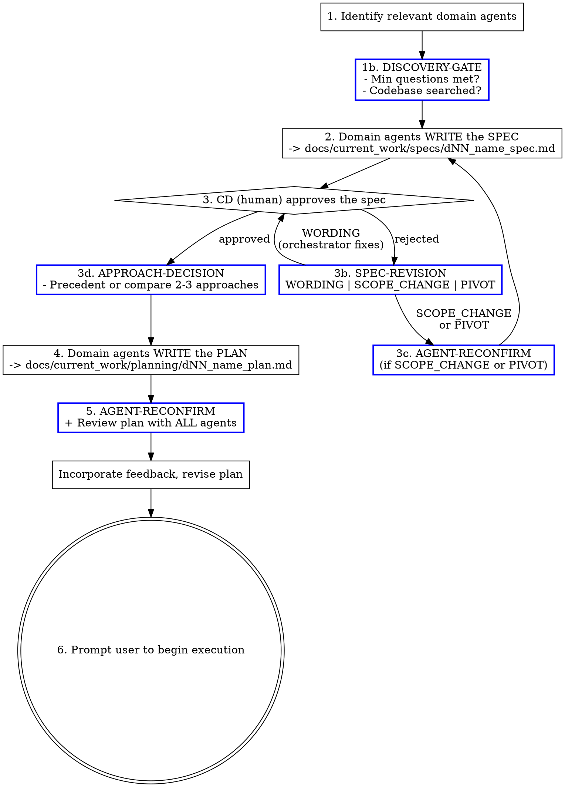

# SDLC Planning

## Overview

Domain agents own the planning lifecycle: they write the spec, they write the plan, they review the plan. You are the orchestrator — you identify which agents are relevant, dispatch them, and ensure the plan is reviewed and approved before declaring it ready for execution.

**This skill produces the plan. It does NOT execute it.** Execution happens via `sdlc-execution`.

**Core principle:** The agent with domain expertise writes and reviews. Never do domain work yourself when an agent exists for it.

## Manager Rule

**The orchestrator never writes spec, plan, or review content.** This applies unconditionally: before dispatching agents, while incorporating review feedback, after re-review, and at every other point in this skill. There is no phase of this skill in which it is correct for you to produce domain content yourself. If you need a spec written or revised — dispatch the domain agent who owns it. If you need a plan revised — dispatch the writing agent. If you notice a problem — dispatch the relevant domain agent to fix it. Noticing a problem yourself does not authorize you to fix it yourself.

**The size of a revision is not a valid reason to self-revise.** "This is a small wording change" or "I'm just incorporating the feedback" is not an exception. Every content change goes through the domain agent who wrote it.

**Orchestrator-editable content:** WORDING-classified spec revisions (typos, phrasing — not meaning changes), date stamps, mechanical count updates (e.g., "3 widgets" → "4 widgets"), and process documentation (Domain Agent Reviews section, dependency table metadata). The boundary is: if it requires domain judgment about code, architecture, or implementation, dispatch. If it's summarizing review outcomes or fixing table formatting, do it yourself.

## Mode Selection

| User Intent | Mode | Entry Point |
|-------------|------|-------------|
| "Build X", "add Y", "new feature", problem statement | **APPLIER** | Full planning workflow (Step 1) |
| "Review this plan", "audit the spec", "check coverage" | **CHECKER** | Audit Workflow below |
| Unclear | Ask: "Are you starting new work, or reviewing existing?" | — |

### CHECKER Mode: Audit Existing Artifacts

When auditing an existing spec or plan (not creating new work):

1. Load the referenced artifact (spec or plan file)
2. Identify which domain agents should review it
3. Dispatch each agent to audit through their domain lens
4. Collect findings — each rated: `critical` / `major` / `minor`
5. Present structured audit to CD:

| Finding | Agent | Severity | Recommendation |
|---------|-------|----------|----------------|
| ... | ... | ... | ... |

6. If CD approves revisions: dispatch agents to fix, then re-audit

**CHECKER mode ends after step 6. APPLIER mode below governs all new planning work.**

## Output

This skill produces two artifacts:

| Artifact | Path | Step |
|----------|------|------|
| Spec | `docs/current_work/specs/dNN_name_spec.md` | 2 |
| Plan | `docs/current_work/planning/dNN_name_plan.md` | 5 |

When complete, prompt the user to begin execution:

> Planning complete. The approved plan is at `docs/current_work/planning/dNN_name_plan.md`.
>
> Ready to execute? Say: **"Execute the plan at docs/current_work/planning/dNN_name_plan.md"**
>
> (Recommend clearing context first — execution benefits from a fresh context budget.)

## Prototype Gate

For tasks with genuine technical uncertainty ("can we parse this data format?", "will [service] support this query?"), run a prototype BEFORE writing the spec:

1. Define the single question to answer
2. Write ≤50 lines of throwaway code on a branch
3. Document the finding in `docs/current_work/prototypes/dNN_name_prototype.md`
4. Use the finding to inform the spec — proceed if feasible, flag to CD if not

**Skip decision must be explicit:** If skipping, state the precedent: "Skipping prototype — this follows the same pattern as [prior implementation]." Do not skip silently.

## Worktree Rule

Assess task scope before starting. Create the worktree **before** step 1 if needed — all domain agent work happens inside it. The execution skill will use the same worktree.

| Scope | Branch Strategy |
|-------|----------------|
| New feature, new integration, new module/adapter | **Git worktree** |
| Breaking changes, multi-step iterative changes | **Git worktree** |
| Modification touching 10+ files | **Git worktree** |
| Bug fix, config change, small modification | Main branch |
| Refactoring (even multi-file) | Main branch |
| Unsure of scope | **Ask the user** |

## The Process



## Agent Selection

### Project-Level Agents (Primary)

These are your project's domain experts. **Always select from here first.**

Located at: `.claude/agents/` (project root)

**Add your project's agents here.** Each agent entry should include the agent name and its domain coverage. Common agent roles:

| Agent | Domain (examples — customize for your project) |
|-------|--------|
| `frontend-developer` | Frontend framework, UI components, state management, search UI |
| `backend-developer` | API layer, database access, background jobs, server config |
| `software-architect` | System design, patterns, scalability, integration strategy |
| `ui-ux-designer` | Visual design, interaction patterns, accessibility |
| `code-reviewer` | Code quality, maintainability, correctness |
| `data-architect` | Database schema, indexes, security rules, storage patterns |
| `domain-specialist` | Core domain logic specific to your product area |
| `data-engineer` | Data pipelines, ETL, background processing, scraping |
| `data-researcher` | External data sources, API evaluation, data validation |
| `debug-specialist` | Root cause analysis, unexpected behavior, regressions |
| `sdet` | E2E tests, integration tests, test architecture, flake diagnosis |
| `performance-engineer` | Web vitals, bundle size, query optimization, rendering perf |
| `realtime-systems-engineer` | WebSocket, real-time communication, streaming |
| `ml-architect` | AI/ML system design, model selection, inference pipelines |
| `ml-engineer` | ML feature implementation, inference services |
| `security-engineer` | Security assessments, vulnerability analysis, compliance |
| `payment-engineer` | Payment integrations, billing, revenue infrastructure |
| `chief-product-officer` | Product strategy, feature prioritization, user value |
| `chief-sales-officer` | Pricing, revenue modeling, go-to-market |
| `legal-advisor` | Legal guidance, compliance, risk assessment |
| `accessibility-auditor` | WCAG compliance, contrast analysis, keyboard navigation, ARIA labeling |
| `build-engineer` | Build infra, bundler config, CI pipeline, package boundaries |
| `refactor-engineer` | Code restructuring, abstraction boundaries, safe incremental refactoring |

*Remove agents not relevant to your project. Add project-specific agents (e.g., `game-integration-engineer`, `payment-engineer`) with their specific domain. Use `/plugin-dev:agent-development` to create new agents.*

### Personal-Level Agents (Fallback)

Generic, stack-agnostic agents. Use when the task extends beyond project-scoped expertise.

Located at: `~/.claude/agents/`

| Agent | Use Case |
|-------|----------|
| `prompt-engineer` | LLM prompt design, optimization, and evaluation for production systems |
| `refactoring-specialist` | Restructuring complex or duplicated code while preserving behavior |
| `search-specialist` | Advanced search strategies, query optimization, targeted info retrieval |
| `content-marketer` | Content strategy, SEO-optimized marketing copy, multi-channel campaigns |
| `seo-specialist` | Technical SEO audits, keyword strategy, search rankings improvement |
| `competitive-analyst` | Competitor analysis, benchmarking, competitive positioning strategy |
| `market-researcher` | Market analysis, consumer behavior, opportunity sizing, market entry |
| `research-analyst` | Multi-source research synthesis, trend identification, detailed reporting |
| `trend-analyst` | Emerging patterns, industry shift prediction, future scenario planning |

### Selection Rule

If an agent's domain touches **any aspect** of the task, include them. When in doubt, include. A 2-minute review that finds nothing costs less than a missed issue that ships.

## Phase Details

### Agent Dispatch Protocol

Before dispatching ANY domain agent in this skill, invoke the `oberagent` skill. oberagent validates the dispatch prompt, selects the correct `subagent_type`, and assigns the appropriate model tier. This is mandatory for every dispatch — spec writing, plan writing, reviews, and revisions. For personal-level agents without frontmatter model assignments, oberagent's model decision table determines the tier.

### 1. Identify Relevant Domain Agents

Before anything else, list which agents are relevant and why:

```
Relevant domain agents for this task:
- frontend-developer: touches UI components and state management
- ui-ux-designer: new UI component needs design review
- software-architect: new pattern being introduced
- code-reviewer: always included for implementation tasks
```

For recurring task types, consult `ops/sdlc/playbooks/` for pre-seeded agent selection and reference implementations.

**DISCOVERY-GATE** — you cannot dispatch agents to write the spec until this block appears in your response:

```
DISCOVERY-GATE
Complexity: SIMPLE (≤2 files) | MEDIUM (3-9 files) | COMPLEX (10+ files)
Min questions required: [2 | 4 | 6]
Questions asked so far: [N]
Codebase searches: [list what you searched for and what you found]
Gate: PASS | FAIL (need [N] more questions)
```

Ask clarifying questions **one at a time** — batched questions get vague answers. Search the codebase BEFORE asking — don't ask what you can look up. Use LSP (`goToDefinition`, `findReferences`, `hover`) to verify function signatures, trace dependencies, and understand interface contracts — do not read files and infer types. Fall back to Grep for string literals and non-TypeScript content. If the gate shows FAIL, ask more questions before proceeding.

**CHRONICLE-CONTEXT** — after the DISCOVERY-GATE passes, scan `docs/chronicle/` for concepts related to this task:

1. List concept directories in `docs/chronicle/`
2. For each concept that could be related (by name or domain), read its `_index.md`
3. If the `_index.md` references deliverables with relevant decisions, patterns, or trade-offs, read those result docs
4. Include the relevant context when dispatching agents for spec and plan writing

```
CHRONICLE-CONTEXT
Related concepts found: [list concept names or "none"]
Key context loaded:
- [concept]: [1-line summary of relevant decision/pattern from result doc]
- [concept]: [1-line summary]
Context included in agent dispatch: yes | no (none relevant)
```

This prevents re-discovering decisions already made. If a prior deliverable established a pattern (e.g., "REST in, WebSocket out" for demo state, array-based health configs), the spec and plan agents should know about it.

### 2. Domain Agents Write the Spec

The spec is the contract between CD (human) and CC (agent system). It defines **what** will be built and **why**, not how.

The primary domain agent writes the core spec. Other relevant agents contribute domain-specific constraints (e.g., `database-architect` adds schema requirements, `security-engineer` adds security constraints).

**Research integration:** If the spec requires research into external services, APIs, competitors, or technologies — invoke oberweb for multi-dimensional web research grounded in project context (CLAUDE.md). Incorporate findings into the spec's Design section.

Reference the template at `ops/sdlc/templates/spec_template.md`. Required fields:
- Problem statement
- Requirements (functional + non-functional)
- Components/packages affected
- Domain scope (all users, specific feature area, infrastructure-only)
- Data model changes
- Interface/adapter changes required
- Depends on (other deliverable IDs)
- Testing strategy (build-only / manual QA / unit tests / E2E)
- Success criteria
- Constraints
- Open questions / unknowns — explicitly state what the spec does NOT know yet. Each unknown is a risk; the plan must address or accept each one.

Save to: `docs/current_work/specs/dNN_name_spec.md`

### 3. CD Approves the Spec

**Hard gate.** Present the spec to the human and wait for explicit approval. Do NOT proceed to planning without approval. Implicit approval is fine ("looks good", "proceed", "yes").

If CD requests changes, classify before acting using the **SPEC-REVISION** block:

```
SPEC-REVISION
CD feedback: [one-line summary]
Classification: WORDING | SCOPE_CHANGE | PIVOT
Action:
  WORDING → orchestrator edits text directly, re-present
  SCOPE_CHANGE → dispatch domain agent(s) to revise affected sections
  PIVOT → AGENT-RECONFIRM + dispatch agents to rewrite spec
```

- **WORDING**: Phrasing, typos, clarifications that don't change what's being built. Orchestrator fixes directly.
- **SCOPE_CHANGE**: Requirements added/removed, packages affected change, new constraints. Dispatch the relevant domain agent to revise. Run AGENT-RECONFIRM (see below) before re-presenting.
- **PIVOT**: Fundamental direction change. Run AGENT-RECONFIRM, then dispatch agents to rewrite the spec from the revised agent list.

**AGENT-RECONFIRM** — emit this block whenever scope changes (SCOPE_CHANGE, PIVOT, or before step 5). Two coverage dimensions are required: package coverage ensures every affected package has an agent; infrastructure coverage ensures every specialized infrastructure domain has its specialist (not just a generalist who happens to work in the same package).

```
AGENT-RECONFIRM
Packages in spec: [list]
Infrastructure touched: [scan the trigger conditions below — list every domain where at least one condition is true]
Agents from step 1: [list]
Coverage check (packages): [each package → agent with domain expertise]
Coverage check (infrastructure): [each infra domain listed above → specialist agent if one exists in the agent table, or "no specialist" if none exists]
Agents to add: [list or none]
Agents to remove: [list or none — only if a domain is no longer touched]
Updated agent list: [final list]
```

**Infrastructure domain trigger conditions** — check each domain by asking its trigger questions, not by scanning file names:

| Domain | Trigger conditions (if ANY is true, list the domain) | Specialist |
|--------|------------------------------------------------------|------------|
| Real-time/WebSocket | Modifies WebSocket handlers, fan-out, connection lifecycle, or pub/sub patterns? | `realtime-systems-engineer` |
| Database/storage | Adds/modifies schema, queries, indexes, security rules, or storage paths? | `data-architect` |
| Payments | Touches billing, pricing, payment state, or revenue infrastructure? | `payment-engineer` |
| ML/AI | Adds/modifies inference, model pipelines, embeddings, or ML data processing? | `ml-architect` / `ml-engineer` |
| Streaming/broadcast | Modifies streaming state, broadcast components, or media integration? | `realtime-systems-engineer` |
| Auth/security | Introduces unauthenticated endpoints, removes auth guards, exposes new public attack surface, changes token handling, or modifies access control? | `security-engineer` |
| Build/CI | Changes build config, monorepo deps, CI pipeline, or package boundaries? | `build-engineer` |
| Data pipelines | Adds/modifies scrapers, sync functions, ETL, or background processing? | `data-engineer` |
| Search | Changes indexes, filter config, or search infrastructure? | (project-specific — check your agent table) |
| Accessibility | Adds new interactive controls, modifies existing UI components, introduces icon-only buttons, changes color/contrast, or adds components with image backgrounds? | `accessibility-auditor` |

*Customize this table for your project's infrastructure domains. Remove domains that don't apply. Add project-specific domains (e.g., "Game integration", "Blockchain", "IoT") with their specialist agents.*

The infrastructure check prevents two common failures:
1. **Generalist masking:** A generalist (e.g., `backend-developer`) covers a package that contains specialist infrastructure (e.g., WebSocket fan-out owned by `realtime-systems-engineer`). Both live in the same package, but the generalist lacks domain depth.
2. **Absence masking:** *Removing* infrastructure (e.g., stripping an auth guard to create a public endpoint) doesn't touch specialist code, so file-based scanning misses it. The trigger conditions catch this because they ask about what the change *introduces*, not just what files it modifies.

### 3d. Approach Decision

After spec approval, before writing the plan — determine the implementation approach:

**APPROACH-DECISION** — you cannot proceed to plan writing until this block appears in your response:

```
APPROACH-DECISION
Precedent: [existing pattern at path/to/file.ts | none found]
If precedent: "Following existing pattern. Skipping comparison."
If no precedent:
  Approach A: [2-sentence description] — tradeoff: [key tradeoff]
  Approach B: [2-sentence description] — tradeoff: [key tradeoff]
  [Approach C: optional]
  Selected: [A/B/C] — reason: [why]
```

If the approach follows an existing codebase pattern with no structural ambiguity, cite the precedent and skip comparison. Otherwise, compare 2-3 structurally different approaches before selecting one.

### 4. Domain Agents Write the Plan

After spec approval, the most relevant domain agent(s) **author** the implementation plan. The agent with the deepest expertise in the primary domain writes the plan. Other relevant agents contribute to sections in their domain.

Reference the template at `ops/sdlc/templates/planning_template.md`.

Example: For a new frontend feature, `frontend-developer` writes the plan, with `ui-ux-designer` contributing the design spec section and `software-architect` contributing the architecture section.

The plan MUST include:
- **Phases with explicit dependencies** — which phases can run in parallel, which must sequence
- **Agent assignments** — which domain agent owns each phase/task
- **WHAT and WHY, never HOW** — Plans specify what must happen and why. Implementation details (HOW) are discovered by the executing agent with fresh context from the actual codebase. Over-specifying HOW in the plan removes the agent's domain contribution and turns execution into typing. Constraint values are part of WHAT — if a phase specifies a limit, threshold, maximum, or allowed set, the value must be concrete (e.g., "maximum 4 copies per card" not "a maximum copy count"). If the value is a product decision the user hasn't made, mark it explicitly (e.g., `USER DECISION NEEDED: max table count — what should the limit be?`) so the reviewer routes it as a product decision for CD.

  **HOW (remove from plans):**
  - Exact code snippets, pseudocode, or algorithms
  - Specific line numbers or code patterns to insert
  - Variable names, function signatures, or import statements
  - Step-by-step implementation sequences ("first do X, then do Y at line 107")
  - Examples of HOW violations: function names (`migrateV5toV6`), field paths (`store.cardQuantities.byId`), comment block positions ("add above line 42"), and ordered implementation steps ("first do X, then do Y")

  **WHAT (keep in plans):**
  - Outcome: "Egress and spectator identities must be unique across reconnects"
  - Constraint: "Must not break stable identities for player/caster/judge roles"
  - Acceptance criteria: "Two concurrent tabs requesting session tokens produce distinct identities"
  - Approach hint (when non-obvious): "Use a random suffix on the identity string"
  - File scope: which files are affected and why
  - Example of correct WHAT: "Update the persistence layer to handle the renamed field" — not "rename `considerations` to `shortlist` in `deckStore.ts` line 87"
- **A "Post-Execution Review" note at the end** — stating that all completed work must be reviewed by all relevant domain agents, and all findings must be fixed before the task is considered done

**Phase limit:** Plans are capped at 7 phases. If a plan reaches phase 8, **stop writing and split into sub-deliverables** (D1a, D1b) before continuing. Over-phased plans signal insufficient decomposition.

**The writing agent must produce the complete plan.** Every section required by the template — package impact, phase dependencies table, phases with agent assignments, and post-execution review — must be present in the agent's output. If the returned plan is missing any template section, re-dispatch the writing agent to complete it. Do not fill in missing sections yourself.

**After the writing agent returns the plan, verify WHAT/WHY compliance before proceeding to review.** Read each phase's outcome and acceptance criteria. If any phase contains a function name, field path, line number, code snippet, or step-by-step algorithm, re-dispatch the writing agent to remove the HOW content. Do not proceed to step 5 with a plan that contains HOW violations. Do not fix HOW violations yourself — re-dispatch the writing agent.

Save to: `docs/current_work/planning/dNN_name_plan.md`

### 5. Domain Agent Plan Review

**AGENT-RECONFIRM** — emit this block before dispatching review agents:

```
AGENT-RECONFIRM
Packages in plan: [list]
Infrastructure touched: [scan each domain's trigger conditions (§3c infrastructure table) — list every domain where at least one condition is true]
Agents from step 1: [list]
Coverage check (packages): [each package → agent with domain expertise]
Coverage check (infrastructure): [each infra domain listed above → specialist agent if one exists in the agent table, or "no specialist" if none exists]
Agents to add: [list or none]
Updated agent list: [final list]
```

Then output the dispatch checklist:

```
Plan review — dispatching:
- [ ] agent-name-1
- [ ] agent-name-2
- [ ] agent-name-3
```

**Every checkbox must have a corresponding agent dispatch. Count the checkboxes. Count the dispatches. They must match.** If the count doesn't match, stop and fix.

Dispatch all review agents in parallel. Collect feedback.

If agents have findings, classify each finding individually in a table before acting — no narrative paragraphs, no blanket dismissals:

```
| # | Finding | Agent | Classification | Severity | Rationale |
|---|---------|-------|---------------|----------|-----------|
| 1 | specific finding | agent-name | FIX / DECIDE / PRE-EXISTING | critical / major / minor | why |
| 2 | ... | ... | ... | ... | ... |
```

Severity applies only to FIX findings. DECIDE and PRE-EXISTING leave Severity blank.
- **critical**: changes the approach, adds or removes files, or changes a phase assignment
- **major**: in-scope quality issue that doesn't change scope
- **minor**: style, polish, or low-impact correction

| Classification | When | Action |
|---------------|------|--------|
| **FIX** | Finding is in scope and the plan should address it | Include in revision dispatch |
| **DECIDE** | Trade-off or product decision the user should make | Invoke the `AskUserQuestion` tool with the finding description and options. Do not type the question as conversational text. Block until CD answers. |
| **PRE-EXISTING** | Finding exists in code the plan does not touch | No action — cite the file and explain why it's out of scope |

**These are the only valid classification types. Do not invent new ones. Severity labels belong in the Severity column, not the Classification column. Do not use narrative dismissals ("ignoring," "off-track," "not relevant"). Every finding gets a row in the table.**

**Low-severity in-scope findings:** If a finding is in scope but has no actionable correction (e.g., purely informational, already consistent with the plan), classify it as FIX with a rationale of "acknowledged, no revision needed." It still gets a row. Do not create a new classification for it.

**PRE-EXISTING rules:** A finding qualifies as pre-existing ONLY if the finding's file is not in the plan's Files list. If the file appears in the Files list, any finding about that file is in scope — regardless of whether the finding is about the specific function the plan modifies.

Only FIX findings go to the writing agent for revision. DECIDE findings go to the user. PRE-EXISTING findings require no action but must appear in the table.

**Incorporating findings:** If there are FIX findings, re-dispatch the domain agent who wrote the plan (from step 4) with only the FIX findings. That agent produces the revision. **You do not write the revision.** This is the Manager Rule — if you find yourself editing the plan directly instead of dispatching the writing agent, stop. Output a dispatch checklist before re-dispatching:

```
Plan revision — dispatching:
- [ ] [writing-agent-name]: incorporate N findings (K critical, M major)
```

**Every checkbox must have a corresponding agent dispatch. Count the checkboxes. Count the dispatches. They must match.** If you find yourself editing the plan directly instead of dispatching the writing agent, stop — that violates the Manager Rule.

**Re-review criteria:** Re-review is mandatory if ANY of the following is true: (1) any FIX finding has Severity = `critical`, (2) the revised plan's file list differs from the pre-revision file list, or (3) a phase was added, removed, or its assigned agent changed. Otherwise — no FIX findings met these criteria — skip re-review. This check is mechanical: scan the Severity column and compare the before/after Files list. Do not reason about whether the revision "changed the approach."

**Re-review dispatch procedure:** When re-review is required, dispatch ALL agents from the step-1 list — not a subset selected based on what changed in the revision. The step-1 agent list determines who reviews. Do not reason about which agents are "relevant to this revision." ALL means the step-1 list.

**Stopping condition:** All agents report no critical or major findings. Minor findings may be acknowledged without a fix — document the decision.

Once the stopping condition is met, append a **Domain Agent Reviews** section to the plan. **This section is mandatory — the plan is not complete without it, even when no agents found issues.**

```markdown
## Domain Agent Reviews

Key feedback incorporated:

- [agent-name] specific, concrete feedback that was incorporated
- [agent-name] another specific feedback point with actionable detail
```

**Rules:**
- Bracket the agent's exact name: `[frontend-developer]`, `[software-architect]`, etc.
- Each bullet is specific and concrete — not generic praise
- Omit agents that found no issues (don't write "[agent] no issues found")

**Format check:** After appending the Domain Agent Reviews section, verify that every bullet begins with `[agent-name]` in square brackets. If any bullet is missing the bracket prefix, correct only the bracket prefix — do not rephrase the finding.

### 6. Prompt for Execution

The plan is reviewed and approved. Enter plan mode so the user gets the standard execution prompt with the option to clear context.

Follow these sub-steps in exact order. Do not combine or skip any.

**6a.** Use the `Read` tool to read the plan file saved in step 4 (`docs/current_work/planning/dNN_name_plan.md`). You need the tool output — do not work from memory.

**6b.** Use `EnterPlanMode`. The content you pass to `EnterPlanMode` must be the complete file contents returned by the `Read` tool in step 6a — pasted in full, start to finish. Do not transform, shorten, summarize, or rephrase the read output in any way. Copy-paste it.

**6c.** Use `ExitPlanMode` immediately after.

**Why this procedure exists:** The LLM's default behavior when asked to "present" content is to summarize it. The Read-then-paste procedure eliminates the summarization pathway by making the file contents the direct input to the tool call, with no intermediate "understand and re-express" step.

The execution prompt appears as:

```
Claude has written up a plan and is ready to execute. Would you like to proceed?

 ❯ 1. Yes, clear context and bypass permissions
   2. Yes, and bypass permissions
   3. Yes, manually approve edits
   4. Type here to tell Claude what to change
```

When execution begins (whether in this session or a fresh one), `sdlc-execution` loads the plan from the saved file.

## SDLC Integration

This skill produces the first two SDLC artifacts (spec + plan). The execution skill produces the third (result).

Not every invocation needs a deliverable ID. For ad hoc work (bug fixes, small tweaks), skip the SDLC artifacts. The compliance audit will surface any substantial undocumented work.

## Red Flags

| Thought | Reality |
|---------|---------|
| "I'll write the plan myself" | Domain agents write. You orchestrate. See Manager Rule. |
| "Skip the spec, it's straightforward" | The spec is the contract between CD and CC. No spec, no plan. |
| "I don't need plan review" | Domain agents catch non-obvious issues in obvious plans. |
| "Only one domain is involved" | Most tasks touch 2+ domains. Check again. |
| "Skip straight to coding, the plan is obvious" | Planning catches issues that cost 10x more to fix during execution. |
| "I'll dispatch without invoking oberagent" | oberagent catches prompt quality issues and ensures correct agent type selection before they waste an agent run. |
| "I'll use opus for everything to be safe" | Model tiers are pre-assigned in agent frontmatter. Trust the assignment. |
| "The agent will figure out what skills to load" | Iron Law 2: subagents don't inherit skill awareness. Load skills in the prompt. |
| "I'll ask all my questions at once to save time" | Batched questions get shallow answers. One question at a time surfaces real constraints. |
| "The approach is obvious, no prototype needed" | Have we built this integration before? If no, define the question a prototype would answer. If yes, cite the precedent. |
| "I don't have unknowns for this task" | All tasks have unknowns. If none surface, the spec hasn't been examined deeply enough. State at minimum: integration risks, performance unknowns, and third-party compatibility unknowns. |
| "This plan needs 8+ phases" | Stop. Split into sub-deliverables before continuing. Over-phased plans mean insufficient decomposition. |
| "I'll include the exact code so the executor knows what to write" | Plans specify WHAT and WHY. Code in plans becomes stale instructions that turn agents into typists. Write acceptance criteria instead. |
| "I'll revise the spec myself, it's just a wording change" | Classify first (SPEC-REVISION). SCOPE_CHANGE and PIVOT need agent dispatch. Only WORDING is orchestrator-editable. |
| "The agent list from step 1 still applies" | Run AGENT-RECONFIRM. Scope changes during spec revision or plan writing can introduce domains not in the original list. |
| "Package coverage is enough, no infrastructure specialists needed" | Generalists mask specialists. Run the infrastructure trigger table — it takes 30 seconds and catches what package-level checks miss. |
| "I'll incorporate the review findings myself, it's faster" | Re-dispatch the writing agent with the findings. Manager Rule applies to revisions too. |
| "I'll just add the structural elements myself — the agent wrote the content" | There is no structural/content distinction. Missing sections (phase dependencies, file list, agents, domain agent reviews) go back to the writing agent. Re-dispatch. |

## Integration

- **oberagent** — Mandatory: validates every agent dispatch prompt, selects correct agent type and model tier
- **sdlc-execution** — The next skill in the pipeline; executes the approved plan
