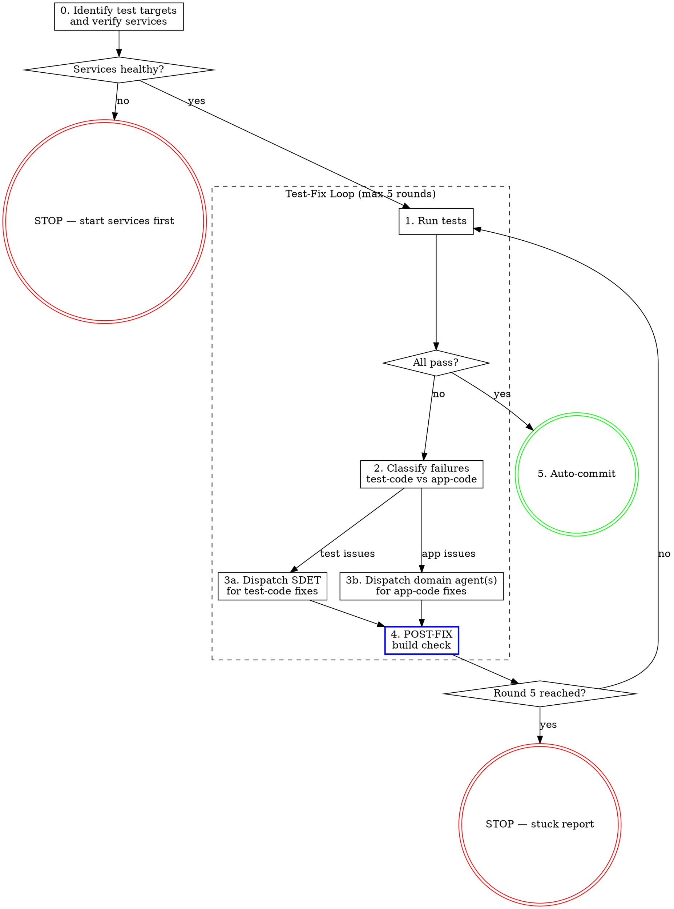

# Automated Test-Fix Loop

Run tests, classify failures, dispatch the right agents to fix them, re-run. Repeat until green or 5 rounds exhausted. Auto-commit when all tests pass.

## Precondition

Tests must already exist. This skill does not write new tests — it runs existing tests and fixes what breaks. If no test files match the target pattern, stop:

> No test files found matching `{pattern}`. Write tests first (use the SDET agent directly), then invoke this skill.

## Inputs

When invoked, determine the test target. The user may specify:
- A specific test file: `tests/feature/my-feature.spec.ts`
- A directory: `tests/feature/`
- A glob pattern: `tests/**/*.spec.ts`
- Nothing (default): run all tests under the project's test directory

If the user references a plan file, extract test file paths from the plan's Files list.

## The Process



## Step Details

### Manager Rule

**The manager (you) never edits code files.** This applies unconditionally. You run tests, read output, classify failures, and dispatch agents. You do not fix test code. You do not fix application code. If you notice a problem, the correct action is to dispatch the relevant agent.

The size of a fix is not a valid reason to self-fix. A one-character typo fix still gets dispatched. There are no small-fix exceptions.

### Agent Dispatch Protocol

Before dispatching ANY agent in this skill, invoke oberagent if available. This applies to SDET dispatches, domain agent dispatches, and fix re-dispatches.

### 0. Setup

1. **Identify test targets** from user input or plan file. Confirm the test files exist using Glob.

2. **Health check** — verify required services are running per project CLAUDE.md. Check immediately, retry once on failure after 2s. If services fail after retry, stop with instructions to start them.

   **No `sleep` before service checks or between test runs.** If a service just restarted, the curl retry handles the brief window. Do not add prophylactic delays.

3. **Environment check** — verify the test environment file exists and the test runner is installed per project CLAUDE.md.

Output the setup summary:

```
Test Loop — Round 0 (Setup)
Targets: {file list or pattern}
Services: {service list with status}
Environment: {env file} ✓ {test runner} {version}
Starting round 1...
```

### 1. Run Tests

Execute the test suite using the project's test runner command (see project CLAUDE.md).

Capture the full output. Parse:
- **Pass count** and **fail count**
- **Failed test names** and their error messages
- **Error locations** (file paths, line numbers, stack traces)
- **Screenshots/traces** if available

If ALL tests pass on this run:
- **Round 1 with no prior dispatches:** Output "All tests passing — no fixes needed" and exit without committing.
- **Round 2+:** Skip to Step 5 (Auto-commit) — agents made fixes that resolved the failures.

Output:

```
Test Loop — Round {N} Results
Passed: {X}/{total}
Failed: {Y}/{total}

Failed tests:
1. {test name} — {one-line error summary}
2. {test name} — {one-line error summary}
...
```

### 2. Classify Failures

For each failed test, classify the failure as **test-code** or **app-code** by analyzing the error:

**Test-code failures** (SDET fixes these):
- Selector not found / element not visible — test is looking for wrong element
- Timeout waiting for condition — test assertion or wait logic is wrong
- Test infrastructure issues — fixture bugs, helper function errors, auth setup problems
- Import errors in test files
- Assertion logic errors — test expects wrong value

**App-code failures** (domain agents fix these):
- UI renders wrong state — component, store, or context bug
- API message not received — broadcast logic, store subscription, or hook bug
- API returns error — route handler, middleware, or service bug
- Build failure in application code
- Runtime errors in application code (console errors, unhandled rejections)
- Auth flow broken — auth provider or guard component bug

**Classification signals:**
- Stack trace points to test files → likely test-code
- Stack trace points to application source files → likely app-code
- "Timeout waiting for" + the condition IS met when you check manually → test-code (bad selector/timing)
- "Timeout waiting for" + the condition is NOT met → app-code (feature not working)
- Error shows auth required when auth should be injected → test-code (auth fixture)
- Error shows correct auth but wrong UI state → app-code

Output the classification table:

```
Failure Classification — Round {N}

| # | Test | Error Summary | Classification | Agent | Rationale |
|---|------|--------------|----------------|-------|-----------|
| 1 | test name | error detail | TEST-CODE | sdet | why |
| 2 | test name | error detail | APP-CODE | backend-developer | why |
| 3 | test name | error detail | APP-CODE | frontend-developer | why |
```

**Domain agent selection for APP-CODE failures:**

| Error Pattern | Agent |
|--------------|-------|
| Real-time message not received/broadcast | realtime-systems-engineer |
| API route returns error, middleware issue | backend-developer |
| UI renders wrong state, component bug | frontend-developer |
| Store/hook returns wrong data | frontend-developer |
| Build failure in application code | build-engineer |
| Performance regression (timeout due to slowness) | performance-engineer |
| Auth flow broken in app code | frontend-developer |
| Multiple packages involved, unclear root cause | debug-specialist |

If a failure is ambiguous, classify as APP-CODE and dispatch `debug-specialist` to diagnose first.

### 3. Dispatch Fixes

Output a dispatch checklist before taking action:

```
Round {N} — Dispatching fixes:
- [ ] sdet: {count} test-code failures ({list})
- [ ] {domain-agent}: {count} app-code failures ({list})
```

**Every checkbox must have a corresponding agent dispatch.** Count the checkboxes. Count the dispatches. They must match.

#### Worktree Isolation for Diagnostics

When a failure's root cause is unclear from the test output and stack trace alone — e.g., the error is "timeout waiting for X" but you can't tell whether X is a test-code or app-code problem without adding instrumentation — use a worktree-isolated investigation agent before dispatching fixes.

**When to use worktree isolation:**
- The failure needs diagnostic logging, temporary instrumentation, or exploratory changes to diagnose
- The root cause spans multiple layers and isn't obvious from the stack trace

**When NOT to use:**
- The failure is clearly classifiable from the test output (e.g., selector not found, import error, explicit assertion failure)

**Worktree investigation protocol:**

1. Dispatch a diagnostic agent with `isolation: "worktree"` to investigate, adding diagnostic logging freely, and report: (1) root cause, (2) which file/function needs the fix, (3) whether TEST-CODE or APP-CODE. Do NOT write a fix — only diagnose.
2. Use the agent's diagnosis to classify the failure and dispatch the correct fix agent in the main tree.
3. The worktree is automatically cleaned up.

**Key principle:** Diagnostic instrumentation never touches the main working tree. Investigation happens in isolation; fixes happen in the main tree.

#### 3a. SDET Dispatch (test-code failures)

Group all TEST-CODE failures into a single SDET dispatch. The dispatch prompt must include:
- The specific test file(s) and line numbers
- The error messages and stack traces
- Screenshots/traces if available
- What the test is trying to verify
- Instruction: fix the test code to correctly verify the intended behavior. Do NOT change application code.

**Test isolation is mandatory.** If tests fail when run in parallel but pass serially, that is a test isolation bug — not a valid workaround. Do NOT accept serial execution as a fix. Dispatch SDET with an explicit instruction to fix isolation so each test uses unique namespaces per worker.

#### 3b. Domain Agent Dispatch (app-code failures)

Group APP-CODE failures by assigned agent. Each agent receives:
- The specific error and what behavior is expected
- The test that exposed the failure (for reproduction context)
- The relevant application code paths (from stack trace)
- Instruction: fix the application code so the described behavior works correctly. Do NOT modify test files.

**Cross-domain knowledge injection:** Domain agents fixing app bugs exposed by tests are working in a testing context they wouldn't normally encounter. Consult `ops/sdlc/knowledge/agent-context-map.yaml` for the `sdet` entry and include the SDET's testing knowledge files (e.g., `testing/gotchas.yaml`, `testing/timing-defaults.yaml`) in the domain agent's dispatch prompt. This helps the agent understand test-specific constraints like timing, fixture patterns, and known gotchas that may affect the fix.

**Scope the dispatch prompt tightly.** Name the exact file(s) and function(s) to change. If the diagnosis identified the root cause, state the cause and the fix location explicitly. Do not use vague prompts like "fix the WebSocket bug" — the agent will interpret latitude as permission to refactor adjacent code.

**Parallel dispatch:** If SDET and domain agent(s) are fixing different files with no overlap, dispatch them in parallel. If there's file overlap risk, dispatch sequentially — domain agent first, then SDET.

#### 3c. Post-Fix Verification

After all agents return:

1. **Build check**: Run the project's build command. If build fails, dispatch the relevant agent to fix the build error. Do not proceed to re-test with a broken build.

2. **File inventory**: List all files modified by agents in this round.

Output:

```
POST-FIX — Round {N}
Build: pass | fail
Files modified:
- {file path} ({agent who modified it})
- {file path} ({agent who modified it})
```

### 4. Loop Control

After POST-FIX passes, increment the round counter and return to Step 1.

**Round tracking:**

```
Round {N}/5 — re-running tests...
```

**3-strike rule per failure:** If the same test fails with the same error category 3 rounds in a row:
1. Document the failure, what was tried, and what each agent returned
2. Remove that test from the target list for remaining rounds
3. Add it to the stuck report

**Round 5 exhausted:** If round 5 completes and tests still fail, output the stuck report:

```
Test Loop — Stuck Report (5 rounds exhausted)

Tests passing: {X}/{total}
Tests still failing: {Y}

Stuck failures:
| Test | Error | Rounds Failed | Agents Dispatched | Last Agent Response |
|------|-------|--------------|-------------------|-------------------|
| name | error | 3,4,5 | sdet, frontend-developer | summary of last attempt |

Hypothesis: {your assessment of why these tests are stuck}

Passing tests were committed. Stuck failures need manual investigation.
```

If ANY tests went from failing to passing during the loop, still auto-commit (Step 5). Stage ALL modified files from the loop — even partial fixes benefit the codebase and should not be discarded because a separate test is stuck.

### 5. Auto-Commit

When all targeted tests pass (or all fixable tests pass and stuck ones are documented):

1. Run the project's build command one final time to confirm
2. Stage all modified files (test code + application code)
3. Create commit with message:

```
fix: resolve test failures in {test area}

{N} test failures fixed across {M} rounds.
{Brief summary of what was fixed}

Co-Authored-By: Claude Opus 4.6 (1M context) <noreply@anthropic.com>
```

4. Output the final summary:

```
Test Loop Complete
Rounds: {N}/5
Tests: {pass}/{total} passing
Commit: {short-sha}

Fixes applied:
- [sdet] {what was fixed in test code}
- [{domain-agent}] {what was fixed in app code}
```

## Red Flags

| Thought | Reality |
|---------|---------|
| "I need to add console.log to figure out what's happening" | Use a worktree-isolated debug agent. Diagnostic instrumentation never touches the main tree. |
| "I'll add temporary logging and clean it up after" | No. Use `isolation: "worktree"` for investigation. Zero cleanup needed. |
| "Fix the [X] bug" (as an agent dispatch prompt) | Too vague. Name the file, function, root cause, and expected fix. Agents interpret latitude as permission to refactor. |
| "Tests pass with sequential execution, ship it" | Serial execution masks isolation bugs. Dispatch SDET to fix isolation. |
| "Let me sleep before checking if the server restarted" | No prophylactic sleeps. Check immediately; retry once on failure. |
| "I'll fix this test myself, it's one line" | Dispatch SDET. Size is not an exception. |
| "I'll fix this app code myself, I can see the bug" | Dispatch the domain agent. You are the manager. |
| "This failure is ambiguous, I'll just try fixing it" | Classify first. If ambiguous, dispatch debug-specialist to diagnose. |
| "All failures are test-code, no need for domain agents" | Verify by checking if the feature actually works. A bad test can mask an app bug. |
| "Skip the build check, tests will catch build issues" | Build check is mandatory after every fix round. |
| "Round 5 and still failing — let me try one more" | 5 is the cap. Output the stuck report. |
| "Same test failed again, let me dispatch the same agent with the same prompt" | That's the definition of insanity. Change the prompt, provide more context, or dispatch debug-specialist. |
| "I'll commit even though some tests fail" | Only commit if ALL targeted tests pass, or if fixable tests pass and stuck ones are documented. |
| "Tests pass but build fails" | Not done. Fix the build first. |
| "I need to read all the source files to understand the failures" | Read the test output and stack traces. Dispatch agents with that context. The agents read the source files. |
| "All these failures look like test issues, no need for domain agents" | Misclassification funnels everything to SDET. Check the classification signals. |

## Integration

- **SDET agent** — fixes test-code issues (selectors, fixtures, helpers, assertions)
- **Domain agents** (frontend-developer, backend-developer, realtime-systems-engineer, debug-specialist, build-engineer, performance-engineer) — fix app-code issues
- **oberagent** — invoked before every agent dispatch (if available)
- **commit-review** — can be run after the auto-commit to verify code quality of the fixes
